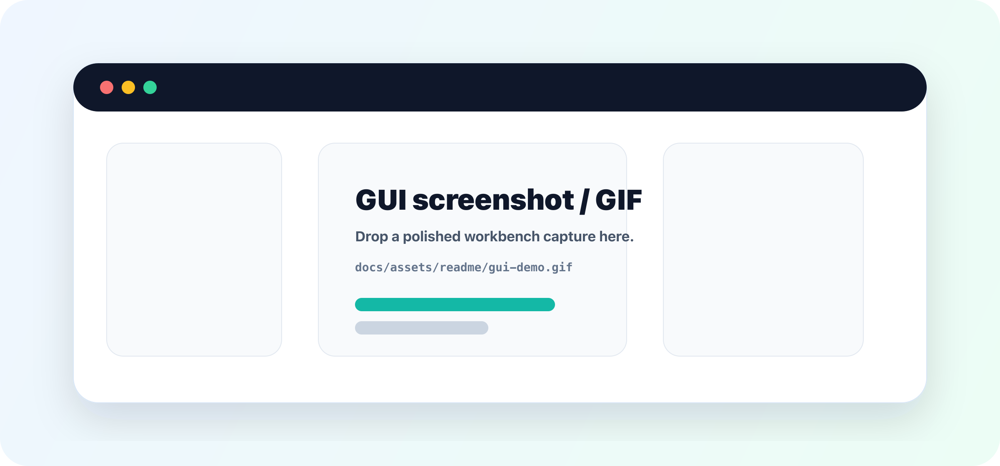
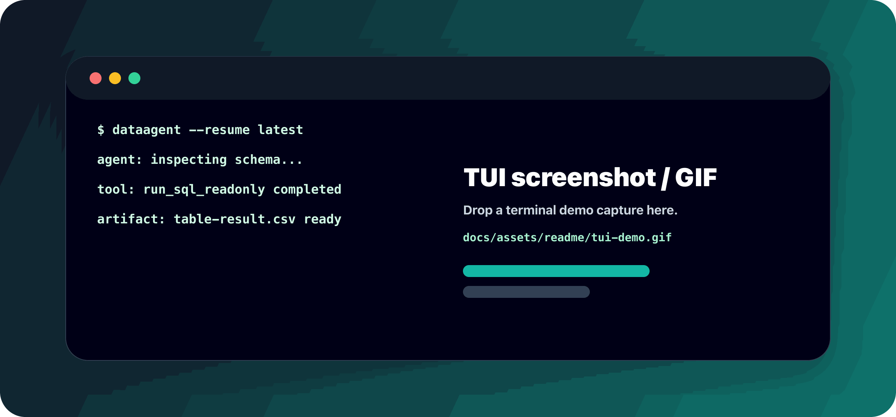

<h1 align="center">DataAgent 🚀</h1>

<p align="center">
  A TypeScript data-agent runtime and workbench for safe, auditable analysis over databases, files, knowledge, and generated artifacts.
</p>

<p align="center">
  <a href="docs/zh/quick-start.md"><strong>Quick Start</strong></a>
  ·
  <a href="docs/README.md"><strong>Docs</strong></a>
  ·
  <a href="docs/zh/reference/supported-datasources.md"><strong>Supported Data Sources</strong></a>
  ·
  <a href="#-contributing"><strong>Contributing</strong></a>
  ·
  <a href="#-license"><strong>License</strong></a>
</p>

## ✨ Why DataAgent

Modern data agents need more than a chat model. They need selected context, datasource boundaries, SQL policy,
auditable events, durable outputs, and a frontend protocol that can replay the whole run.

DataAgent puts those pieces behind one runtime:

- 🔎 **Schema-first analysis** — the agent inspects datasource structure before it can run read-only SQL.
- 🧠 **Governed context** — conversation history, memory, tool results, files, and knowledge sources are compiled under one budget.
- 🧾 **Auditable execution** — AG-UI events, SQL audit logs, artifacts, and session history are persisted as replayable records.
- 📦 **Unified assets** — uploads, workspace files, generated outputs, and KB imports share the same deduplicated asset layer.
- 🧩 **Protocol-ready runtime** — CopilotKit / AG-UI clients consume the same events, run state, artifacts, and replay data.

## 🗄️ Bring Your Data Stack

DataAgent is built around a Data Gateway adapter boundary. The current runtime already recognizes local files,
embedded databases, cloud warehouses, lakehouse engines, operational databases, and search / NoSQL systems.

<p align="center">
  
</p>

## 🧭 How It Works

<p align="center">
  
</p>

The frontend talks to a single backend runtime. The backend owns identity, run replay, context assembly, memory,
tool policy, SQL guardrails, file references, and artifact creation. The model sees a governed prompt; it never sees raw
datasource credentials. 🛡️

## 🎬 GUI And TUI Preview Slots

These are reserved for polished product captures. Replace the placeholder assets with screenshots or GIFs when the GUI
and TUI demos are ready.

<table>
  <tr>
    <td></td>
  </tr>
  <tr>
    <td></td>
  </tr>
</table>

## ⚡ Quick Start

```bash
npm install
cp .env.example .env
cp apps/web/.env.example apps/web/.env.local
npm run dev
```

Open the workbench:

```text
http://127.0.0.1:3000/data-tasks
```

The local workbench includes a demo DuckDB datasource. Live agent runs require a real LLM key in `.env`.

```text
LLM_PROVIDER=openai-compatible
LLM_MODEL=qwen-plus
LLM_BASE_URL=https://dashscope.aliyuncs.com/compatible-mode/v1
LLM_API_KEY=replace-with-your-key
```

DeepSeek and other OpenAI-compatible providers use the same provider mode:

```text
LLM_PROVIDER=openai-compatible
LLM_MODEL=deepseek-chat
LLM_BASE_URL=https://api.deepseek.com
LLM_API_KEY=replace-with-your-key
```

## 🧩 What You Can Build With It

| Use case | Runtime support |
| --- | --- |
| Natural-language database analysis | Datasource selection, schema inspection, SQL guard, query limit, timeout, audit log, table artifact. |
| File-backed agent work | Session workspace, cross-session workspace assets, file refs, downloads, generated deliverables. |
| Knowledge-assisted analysis | KB imports, document chunks, local search, optional embedding-backed retrieval, governed context injection. |
| Frontend agent UX | CopilotKit / AG-UI streaming, run replay, task state, token usage, artifacts, interaction suspension. |
| Controlled tool extension | Mastra tools, MCP middleware, workspace tools, skill packages, tool observation adapters. |

## 🛠️ Developer Loop

```bash
npm run build
npm run smoke:config-api
npm run smoke:data-gateway
npm run smoke:copilotkit
npm run smoke:docs
```

Use targeted smoke checks for the package you touch. `package.json` lists the full verification set.

## 🤝 Contributing

DataAgent is moving quickly, so small, well-scoped contributions are easiest to review.

1. Open an issue or discussion for behavioral changes, protocol changes, datasource adapters, and agent-policy changes.
2. Keep pull requests focused on one runtime boundary or feature area.
3. Run `npm run build` and the targeted smoke checks for the packages you touched.
4. Update docs when a change affects setup, APIs, datasource configuration, event behavior, or user-visible output.
5. Do not commit credentials, local databases, generated storage, or private benchmark data.

## 🛣️ Roadmap

<table>
  <tr>
    <td><strong>Semantic data operating layer</strong><br/>Build a durable business semantic layer for metrics, entities, joins, lineage, policies, and reusable analytical concepts.</td>
    <td><strong>Autonomous analyst loops</strong><br/>Let agents plan investigations, run controlled experiments, critique findings, and converge on evidence-backed conclusions.</td>
  </tr>
  <tr>
    <td><strong>Evaluation and reliability lab</strong><br/>Create repeatable NL2SQL, retrieval, tool-use, and end-to-end task benchmarks with regression gates and failure forensics.</td>
    <td><strong>Multimodal knowledge fabric</strong><br/>Unify tables, documents, notebooks, charts, images, logs, and generated files into one governed context and retrieval fabric.</td>
  </tr>
  <tr>
    <td><strong>Agent app platform</strong><br/>Expose DataAgent as a platform for domain-specific analytical agents, reusable workflows, custom tools, and shareable agent apps.</td>
    <td><strong>Enterprise control plane</strong><br/>Add multi-tenant governance for identity, RBAC, approvals, audit export, policy-as-code, cost limits, and deployment operations.</td>
  </tr>
</table>

## 📚 Documentation

<table>
  <tr>
    <td><a href="docs/zh/quick-start.md"><strong>Quick Start</strong></a><br/>Install, configure a model key, and run the workbench.</td>
    <td><a href="docs/zh/overview.md"><strong>Product Overview</strong></a><br/>Understand the product positioning and analysis workflow.</td>
  </tr>
  <tr>
    <td><a href="docs/zh/reference/supported-datasources.md"><strong>Supported Data Sources</strong></a><br/>Datasource types, fields, and connection boundaries.</td>
    <td><a href="docs/zh/reference/agent-runtime.md"><strong>Agent Runtime</strong></a><br/>CopilotKit / AG-UI run input, events, and safety boundaries.</td>
  </tr>
  <tr>
    <td><a href="docs/zh/reference/rest-api.md"><strong>REST API</strong></a><br/>HTTP endpoints for local development and integration.</td>
    <td><a href="docs/zh/architecture/overview.md"><strong>Architecture</strong></a><br/>High-level runtime, Data Gateway, files, knowledge, and artifacts.</td>
  </tr>
</table>

## 🧪 Status

DataAgent is under active development. Current code, public docs, and passing smoke checks are the source of truth.

## 📄 License

Apache License 2.0. See [LICENSE](LICENSE).
