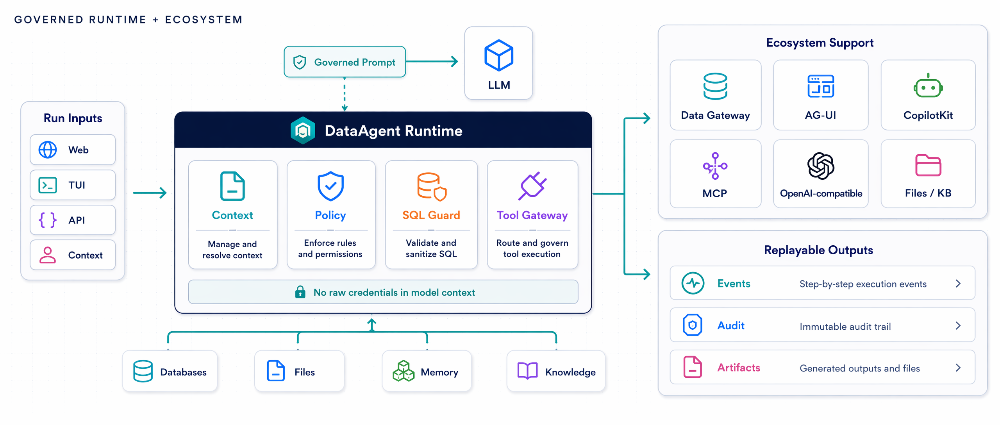
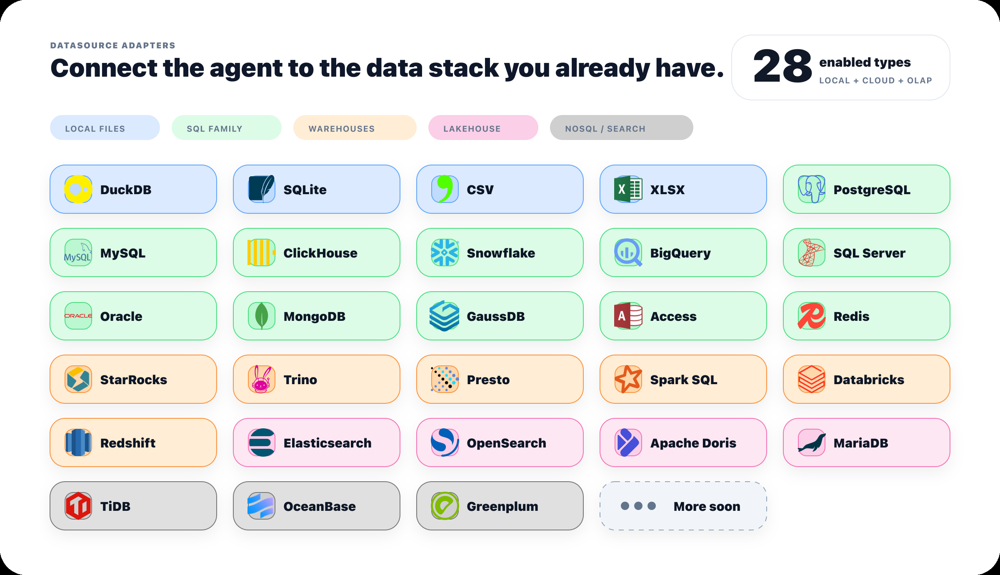

<h1 align="center">DataFoundry</h1>

<p align="center">
  An enterprise-grade Data Agent workbench — it reads business definitions through unified semantics, runs complex multi-table, multi-step analysis inside read-only boundaries,<br />
  and keeps every step auditable and replayable, turning one question into a trustworthy analysis.
</p>

<p align="center">
  <strong>28 datasource types out of the box · Enterprise semantics & context · Self-hosted · Multi-model · Fully auditable</strong>
</p>

<p align="center">
  <strong>English</strong> · <a href="README_zh.md">简体中文</a>
</p>

<p align="center">
  <a href="#-run-it-in-5-minutes"><strong>Quick Start</strong></a>
  ·
  <a href="https://datagallery-lab.github.io/datafoundry/"><strong>Docs</strong></a>
  ·
  <a href="docs/en/reference/supported-datasources.md"><strong>Supported Data Sources</strong></a>
  ·
  <a href="#️-roadmap"><strong>Roadmap</strong></a>
  ·
  <a href="#-contributing"><strong>Contributing</strong></a>
</p>

<p align="center">
  
  
  
  
  
  <br />
  <a href="https://github.com/mastra-ai/mastra"></a>
  <a href="https://github.com/ag-ui-protocol/ag-ui"></a>
  <a href="https://github.com/vadimdemedes/ink"></a>
</p>

<p align="center">
  
</p>

---

## 🤔 What Is DataFoundry

When teams let AI query enterprise databases, the real worry is never "can the model write SQL." It is: **does it understand business definitions? Could it mutate production data? Could credentials leak into context? Can a conclusion be verified after the fact?**

Most tools reduce the problem to `prompt → SQL → answer` — impressive in a demo, dead on arrival in the enterprise. DataFoundry takes a different path: **it puts the agent inside a semantic, policy-aware, evidence-preserving data task system**, upgrading natural-language analytics into controllable, trustworthy, verifiable data work.

## ✨ Core Capabilities

- 🗄️ **28 datasource types, ready out of the box** — From PostgreSQL, MySQL, Snowflake, BigQuery, and ClickHouse to MongoDB, Redis, and Elasticsearch: connect your existing data stack quickly, cut integration cost, and get the agent into real business analysis faster.
- 🧠 **Enterprise semantics and context organization** — Manage schema, metric definitions, and field relationships in one place, so terms like "GMV" and "retention" resolve to enterprise-approved tables, fields, and definitions — fewer guessed fields, wrong joins, and definition drift, and fundamentally better accuracy.
- 🏠 **Self-hosted deployment and multi-model support** — Run it inside your own boundary so data never leaves; on the model side, any OpenAI-compatible provider works (Qwen, DeepSeek, GPT, ...), letting you balance security, cost, latency, and quality per scenario.
- 🔒 **Safe by default, auditable throughout** — Read-only queries, credential isolation, field masking, row limits, and timeouts by default; SQL, tool calls, and event streams are fully persisted and replayable, so every conclusion is backed by evidence.
- 🧩 **Deep optimization for complex data tasks** — Built for multi-table, multi-field, long-horizon analysis and multi-step reasoning: complex questions get decomposed, verified, and converged into trustworthy conclusions, materialized as tables, charts, and reports the team can reuse.

## 🚀 Run It In 5 Minutes

No database required — a built-in DuckDB demo datasource works out of the box.

```bash
git clone https://github.com/datagallery-lab/datafoundry.git
cd datafoundry
npm install
cp .env.example .env
cp apps/web/.env.example apps/web/.env.local
npm run dev
```

Configure any OpenAI-compatible model in `.env`:

```bash
LLM_PROVIDER=openai-compatible
LLM_MODEL=qwen-plus                # or deepseek-chat, gpt-4o, ...
LLM_BASE_URL=https://dashscope.aliyuncs.com/compatible-mode/v1
LLM_API_KEY=replace-with-your-key
```

Open `http://127.0.0.1:3000/data-tasks` and ask:

```text
Show me the tables in this datasource and explain the main fields of each.
```

You will see the full chain: schema inspection → read-only SQL → SQL audit → table output → replayable run history.

> See the [Quick Start](docs/en/quick-start.md) for details, and the [Data Sources guide](docs/en/guides/data-sources.md) to connect your own PostgreSQL / MySQL / CSV and more.

## 🆚 How It Differs From Coding Agents And SQL Chatbots

Coding agents change code, SQL chatbots answer questions, DataFoundry runs data tasks — three different operating objects, risk boundaries, and outputs:

| | Works on | Main risk | Output |
| --- | --- | --- | --- |
| Coding agent | Repos, tests, PRs | Breaking code | Patch, commit, PR |
| SQL chatbot | Prompt, SQL, answer | Wrong tables, unsafe access, leaked credentials, no replay | A SQL snippet or an answer |
| **DataFoundry** | Datasources, files, knowledge, tools, task state | Production data boundaries, business semantics, audit evidence | **Replayable data tasks** + SQL audit + tables / charts / reports |

On data tasks specifically, DataFoundry's core advantages over a general-purpose coding agent are:

- **Accuracy, from data constraints** — Pointed at a database, a coding agent tends to guess tables, fields, and definitions; DataFoundry enforces schema-first analysis and constrains query paths through Data Gateway, cutting guessed fields and wrong joins.
- **Safety, from controlled execution** — Coding agents run commands and write files: powerful, but high-risk against enterprise data. DataFoundry defaults to read-only SQL, credential isolation, field masking, row limits, timeouts, and audit — built for real data environments.
- **Speed, from a converging task path** — Not because the model reasons faster, but because datasource selection, schema caching, context budgeting, tool policy, and the artifact pipeline eliminate wasted attempts, so analysis converges on results sooner.
- **Complex tasks, from data-workflow design** — Coding agents excel at code engineering; DataFoundry is built for analysis across many tables, fields, and metrics plus knowledge bases, files, and report outputs, chaining "query, verify, explain, materialize" into one complete flow.
- **Adoption, from an enterprise runtime** — This is not a demo: the Web workbench, TUI, REST API, CopilotKit / AG-UI, Data Gateway, Skills, MCP, Files, Artifacts, and Metadata combine into an operating foundation for data agents.

## ⚙️ How A Data Task Runs

```text
Ask → Align semantics → Execute under control → Materialize output → Replay & review
```

1. **Define the task** — Pick datasources, files, knowledge, and tools, then describe the business question in natural language.
2. **Align meaning with structure** — The agent inspects schema and available context first, grounding terms like "GMV" or "retention" in real tables and fields.
3. **Execute under control** — Data Gateway runs queries inside a read-only boundary with SQL guardrails, row limits, timeouts, and masking; every SQL statement leaves an audit record.
4. **Materialize output** — Results become tables, charts, reports, or files — assets the team can cite.
5. **Replay and review** — Web, TUI, and API share one run history, so every step's evidence is always one click away.

<p align="center">
  
</p>

## 🖥️ More Than A Chat Box

The **Web workbench** fits day-to-day analysis and demos, the **TUI** fits terminals and remote servers, and the **API / CopilotKit / AG-UI** path lets you embed the same trusted runtime into your own product.

<p align="center">
  <a href="docs/assets/readme/tui-demo.mp4">
    
  </a>
</p>

## 🗄️ Bring Your Data Stack, No Rebuild

Connect through Data Gateway adapters: the built-in DuckDB demo works out of the box; SQLite, CSV, Excel, PostgreSQL, and MySQL fit local trials; cloud warehouses, search engines, and NoSQL systems plug in with their own services and credentials.

<p align="center">
  
</p>

See the full list in [Supported Data Sources](docs/en/reference/supported-datasources.md).

## 🛡️ Security Boundary

- The model only receives governed context; datasource credentials, model API keys, and MCP tokens never enter `messages`, `context`, or `forwardedProps`.
- All datasource access goes through Data Gateway — read-only by default, with SQL guardrails, row limits, timeouts, and field masking.
- SQL audit logs, tool-call records, and event streams are fully persisted for after-the-fact review.
- Production-grade multi-tenant auth, centralized secret management, monitoring, and deployment operations require a dedicated design for your environment — see [Security](docs/en/security.md).

## 🗺️ Roadmap

- [x] **Governed data-task workbench** — Web and TUI share one TypeScript agent runtime, CopilotKit / AG-UI event stream, replayable run history, SQL audit trail, and unified asset layer.
- [x] **Safe data access foundation** — Datasource registration, connection testing, schema introspection, table preview, read-only SQL, masking, knowledge imports, MCP resources, skill packages, and model configuration.
- [ ] **Unified semantic layer** — Durable metrics, entities, relationships, lineage, and policies, moving agents from "guessing fields" to "understanding business definitions" and from one-off SQL to a governable data operating layer.
- [ ] **Autonomous analyst loops** — Agents that plan investigations, run controlled experiments, critique findings, and converge on evidence-backed conclusions.
- [ ] **Evaluation and reliability lab** — NL2SQL, retrieval, tool-use, and end-to-end task benchmarks with regression gates and failure forensics.
- [ ] **Enterprise control plane** — Identity, RBAC, approvals, audit export, policy-as-code, and cost limits.

Roadmap discussions are welcome in issues and discussions.

## 📚 Documentation

| Goal | Read |
| --- | --- |
| Run the local demo | [Quick Start](docs/en/quick-start.md) |
| Understand positioning and scope | [Overview](docs/en/overview.md) · [Capabilities](docs/en/capabilities.md) |
| Use the Web / TUI | [Web workbench guide](docs/en/guides/web-workbench.md) · [TUI guide](docs/en/guides/tui.md) |
| Connect data sources | [Data sources guide](docs/en/guides/data-sources.md) · [Supported data sources](docs/en/reference/supported-datasources.md) |
| Integrate via API and runtime | [REST API](docs/en/reference/rest-api.md) · [Agent Runtime & AG-UI](docs/en/reference/agent-runtime.md) |
| Understand architecture and security | [Architecture overview](docs/en/architecture/overview.md) · [Security](docs/en/security.md) |

## 🤝 Contributing

DataFoundry moves quickly, so small, well-scoped PRs are the easiest to merge:

1. Open an issue or discussion first for behavioral, protocol, datasource-adapter, or agent-policy changes.
2. Keep each PR focused on one runtime boundary or feature area.
3. Run `npm run build` plus the targeted smoke checks for what you touched (e.g. `npm run smoke:data-gateway`).
4. Update docs when a change affects setup, APIs, datasource configuration, or user-visible output.
5. Do not commit credentials, local databases, generated storage, or private benchmark data.

See [CONTRIBUTING.md](CONTRIBUTING.md) for details.

## 💬 Community

Join the DataFoundry community to discuss the product, roadmap, and real-world adoption with us. Issues and discussions are always welcome too.

<table align="center">
  <tr>
    <td align="center"><strong>Slack Community</strong></td>
    <td align="center"><strong>QQ Group</strong></td>
  </tr>
  <tr>
    <td align="center"></td>
    <td align="center"></td>
  </tr>
  <tr>
    <td align="center"><a href="https://join.slack.com/t/datafoundry-7bb8405/shared_invite/zt-42qikc65e-DwA~8ltIri_WYWWpRMjCFQ"><strong>Join Slack</strong></a></td>
    <td align="center"><strong>Group ID</strong><br><code>1048076064</code></td>
  </tr>
</table>

## 🙏 Acknowledgements

DataFoundry is inspired by and built with ideas from excellent open-source projects and communities:

- Thanks to the [LINUX DO](https://linux.do/) community for their support and discussions.
- [Mastra](https://github.com/mastra-ai/mastra) for agent runtime patterns.
- [AG-UI](https://github.com/ag-ui-protocol/ag-ui) for event stream protocol design.
- [CopilotKit](https://github.com/CopilotKit/CopilotKit) for agent-native UX patterns.
- [Ink](https://github.com/vadimdemedes/ink) for terminal UI foundations.
- [MCP](https://modelcontextprotocol.io) for the tool ecosystem and integration model.

## 📄 License

Apache License 2.0. See [LICENSE](LICENSE).

> DataFoundry is under active development. Current code, public docs, and passing smoke checks are the source of truth.
