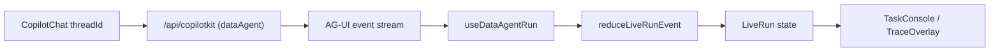

# Data Agent Session Page — Design

This page (`/data-tasks`) is a **data-agent workbench** built on CopilotKit v2
(`@copilotkit/react-core/v2`). It is a **real frontend**: it talks to the live
`dataAgent` backend over the CopilotKit / AG-UI protocol and renders only what
the backend actually streams. There is no mock scenario or scripted demo.

The backend protocol surface is the source of truth for what is renderable; see
[copilotkit-ag-ui-frontend-protocol.md](../../../../../docs/engineering/copilotkit-ag-ui-frontend-protocol.md).
This document describes how the page maps that protocol to UI.

## Layout

Three-column responsive grid:

```
grid-cols-[280px_minmax(0,1fr)]
xl:grid-cols-[300px_minmax(420px,1fr)_380px]
```

- **Left — `SessionPane`**: workspace default config rows (DB/KB/MCP/LLM/Skill,
  opening `WorkspaceConfigPanel`) + client-side session list.
- **Middle — `ChatPane`**: a stock `CopilotChat` bound to the active session's
  `threadId`, plus the inline tool-call trace cards.
- **Right — `TaskConsole`**: a tabbed data-task console with four tabs —
  Overview / Trace / Outputs / Detail — derived from the live run. The Detail
  tab is selection-driven: clicking a tool card in the middle column (or a
  trace entry) auto-switches to it. Shown at `lg` and up; hidden below `lg` to
  protect the middle column (a toggleable drawer for narrow screens is deferred).

## Workspace configuration model (DB / KB / MCP / LLM / Skill)

State + schema live in [data-task-state.ts](./data-task-state.ts); UI lives in
[page.tsx](./page.tsx). The backend-side contract and the capability gap list:

- [config-management-api.md](../../../../../docs/engineering/config-management-api.md)
  — REST contract for config management + `run_config` merge model.
- [frontend-backend-capability-requests.md](../../../../../docs/engineering/frontend-backend-capability-requests.md)
  — what the frontend needs the backend to implement, prioritized.

### Three-layer resolution

The left panel is a **workspace default config center**, not a per-run picker.

```
effectiveRunConfig = merge(workspaceDefaults, perRunOverrides, serverPolicy)
```

1. **Workspace defaults (left panel)** — DB / KB / MCP / LLM / Skill entries are
   *static defaults*. Every entry is **default-available**; there are **no
   per-item enable toggles**. Wording is "工作区默认配置 / 默认可用", never
   "本轮启用/禁用". Persisted in `localStorage` (`data-tasks:workspace-config:v1`).
2. **Per-run override (chat input area)** — deferred. The dialog near the input
   is where a single run turns things on/off without mutating workspace
   defaults. Today only the LLM model picker (`ChatModelPicker`) exists as a
   partial implementation.
3. **Server policy (backend)** — the final authority; merges the above with
   permission/policy. Today the backend only honors `datasourceId` (capability
   request #3 wires full `run_config` consumption).

### Expose only what the backend can consume

The visible field set is **grounded in the backend's verified Data Gateway
capability**, not in aspiration. Speculative fields are NOT shown; their full
contract is kept in `config-management-api.md` and restored to the UI when the
matching backend capability ships.

| Config | UI exposes today | Backend reality |
| --- | --- | --- |
| DB | `datasourceId` `type`(duckdb/sqlite/csv/xlsx) `mode`(readonly) `filePath` | only these 4 adapters exist |
| KB | `indexName` `retrievalTopK` (row marked **后端未支持**) | interface only, no impl |
| MCP | `transport` `serverUrl` (row marked **后端未支持**) | no impl at all |
| LLM | `provider` `baseUrl` `apiKey` `modelName` | env-driven, no per-run switch |
| Skill | 上传 `SKILL.md` / `.zip`（元数据只读） | no skill concept |

### Field schema system (`data-task-state.ts`)

`WORKSPACE_CONFIG_FIELDS[kind]` is a list of `ConfigFieldDef`. A field can be:

- `required` — enforced by `isWorkspaceConfigItemValid` (used to gate "create").
- `visibleWhen(settings)` — **conditional field** (e.g. DB `filePath` shows only
  for file types; server fields only for server types).
- `requiresCapability` — **capability-gated** (see below).
- `readOnly(item)` — e.g. builtin core fields, forced `mode=readonly`.

`visibleConfigFields(kind, settings)` applies the capability + `visibleWhen`
filter; the detail view and validation both use it, so they stay consistent.

### Capability gating (forward-compatible, flip-a-flag)

`BACKEND_CAPABILITIES` (all `false` today) + `hasCapability()` gate fields via
`requiresCapability`. Deleted/aspirational fields are **kept in the schema as
gated-off** so restoring them is a flag flip, not a re-author:

| capability flag | unlocks when backend ships | gated fields |
| --- | --- | --- |
| `datasource.server` | PostgreSQL / MySQL adapters (#2) | DB type options + host/port/database/schema/username/password |
| `datasource.queryPolicy` | env `SQL_*` wired into Gateway (#5) | DB maxRows / timeoutMs |
| `llm.samplingParams` | per-run sampling consumed (#4) | LLM temperature / maxTokens |

### Credentials never cross the AG-UI protocol

API keys / tokens / passwords live in `localStorage` only. The embedded
`workspaceConfig` is stripped of secret keys (`apiKey`/`token`/`secret`/
`password`/`credentialsJson`) by `sanitizeWorkspaceConfig`; the LLM profile in
state exposes a `hasApiKey` boolean instead of the raw value. Reserved fields
`WorkspaceConfigItem.secretRef` and `.status` are placeholders for the backend
secretRef model (`config-management-api.md §1.2`) — backend stores the secret
once over HTTPS and the stream only ever carries ids.

### Run context sent today

Two `useAgentContext` items (+ `forwardedProps.datasourceId`):

- `datasource_id` — the one field the backend currently honors (protocol §2).
- `run_config` — single forward-compatible payload built by `buildRunConfig`
  matching `config-management-api.md §5`; **ids / selections only, no secrets**:

```jsonc
{
  "enabledDatasourceIds": [...], "enabledKnowledgeIds": [...],
  "enabledMcpServerIds": [...], "enabledSkillIds": [...],
  "activeDatasourceId": "api-duckdb-demo",
  "activeLlmProfileId": "...", "activeSkillId": "data-agent-default"
}
```

The backend ignores `run_config` until capability #3 lands; sending it now means
no protocol change is needed later. (A third `当前数据任务工作区状态` item carries
sanitized workspace state for debugging.)

## Backend wiring (the real data flow)



- The `CopilotKit` provider points at `NEXT_PUBLIC_AGENT_RUNTIME_URL`
  (default `http://127.0.0.1:8787/api/copilotkit`) with `agentId="dataAgent"`.
- [use-data-agent-run.ts](./use-data-agent-run.ts) subscribes to the agent and
  reduces the AG-UI stream into a `LiveRun` via
  [live-run-state.ts](./live-run-state.ts).
- Events consumed: `RUN_STARTED/FINISHED/ERROR`, `STATE_SNAPSHOT/DELTA`,
  `ACTIVITY_SNAPSHOT/DELTA` (plan + step), `TOOL_CALL_*`, and
  `CUSTOM` (`sql_audit`, `artifact`). Text and reasoning are rendered by the
  stock `CopilotChat`.
- Timeline events use a **tool-agnostic** `DataStepKind`
  (`inspect | query | transform | fetch | visualize | knowledge | other`),
  mapped from the tool name by `dataStepKindForTool`. Today the backend only
  emits `inspect` (`inspect_schema`) and `query` (`run_sql_readonly`); any other
  tool degrades to a generic `other` step instead of masquerading as a schema
  inspection, so non-SQL data scenarios slot in without re-architecture.

### datasource selection

The selected datasource is sent two ways for redundancy, matching the protocol
priority order:

- `CopilotKit properties={{ datasourceId }}` → AG-UI `forwardedProps.datasourceId`
  (highest priority the protocol honors from the client).
- `useAgentContext({ description: "datasource_id", value })` as a fallback.

There is no datasource registry API, so `datasourceId` is fixed to
`api-duckdb-demo`.

## Sessions (client-side threads)

The backend has no session list or persistence API — only a per-run `threadId`.
Sessions are therefore managed entirely on the client:

- Each session owns its own `threadId` (`crypto.randomUUID()`); the list is
  persisted in `localStorage` (`data-tasks:sessions:v1`).
- `useAgent` / `CopilotChat` cache a per-`(agentId, threadId)` agent clone, so
  switching `threadId` gives each session isolated messages and run state.
- `useDataAgentRun` resets its `LiveRun` whenever `threadId` changes.
- New session = push a new `threadId`; switching = change the active id.

`useThreads` (durable Intelligence threads) is intentionally **not** used: it
requires the runtime in Intelligence mode, which this backend does not run.

## TaskConsole mapping

Organized around the data-task lifecycle (not around tools): what was asked →
how the agent moved data → can it be trusted → what can be taken away. Four tabs
(Overview / Trace / Outputs / Detail) own one granularity each so nothing is
duplicated. An **action** `selection` (from a middle-column tool card or a trace
entry) auto-switches to the Detail tab via a `useEffect`; clicking any non-Detail
tab clears the selection. Artifact clicks stay on **产出** and expand in-place.

- **Overview tab** —
  - `ConclusionZone`: run status, current question (the latest user message via
    `useDataAgentRun().latestQuestion`), and **tool-agnostic** roll-up metrics —
    步骤数 / 工具成功比 / 运行耗时 / 产出数 (from `deriveRunUsage().toolCalls`),
    plus a single muted **run-level** token line lit only when the backend emits
    `token_usage`. No SQL-specific headline numbers (those are per-step, shown in
    Trace/Detail).
  - `DynamicStepsList`: the progress checklist is derived from the **real**
    executed `liveRun.toolCalls` (not the hardcoded backend `ACTIVITY` plan), so
    new backend tools appear automatically. Each step shows `dataStepLabel`,
    a status dot (running/success/failed), and single-step duration; clicking a
    step opens its Detail. The reducer still keeps `liveRun.plan`, but the UI no
    longer renders it.
  - `ToolDistributionZone`: per-tool call counts (`byTool`) — whoever ran shows.
- **Trace tab (`EvidenceZone`)** — the chronological evidence chain rendered by
  the shared `TraceList` from `buildTraceTimeline`; each card carries that step's
  duration/rows inline (per-step granularity). A `放大全屏` button opens the same
  content in `TraceOverlay`.
- **Outputs tab (`DeliverablesZone`)** — the artifact shelf, fed by
  `CUSTOM(artifact)` (tab badge = artifact count). Clicking a card **expands
  inline** in this tab (dataset/SQL/chart/report preview via `ArtifactDetailView`);
  it does not jump to Detail. When `createdByEventId` is known, an optional
  「来源步骤 → 在详情中查看」 link opens the producing step in Detail. Export/download
  is gated behind `artifact.export` (#9) as a labeled placeholder.
- **Detail tab** — selection-driven for **steps/actions only**. For an action it
  shows single-step duration + status (from the matching `toolCall`), reasoning,
  action detail (inspect/query/generic), a per-step usage placeholder (按步骤 Token
  待后端支持), and produced-artifact lineage (expand inline); for an artifact it
  shows the artifact view only when navigated from trace lineage. With no
  selection it shows an empty prompt to pick a step.
- **Full trace (`TraceOverlay`)** — the same evidence chain as a full-screen
  overlay for focused triage when the chat result is missing.

The middle→right linkage for steps is via the right console itself: click a step
in **概览** progress list or **追溯** timeline to open the Detail tab.

## Backend-unsupported affordances (kept as labeled placeholders)

These exist in the UI for shape/affordance but are explicitly marked
**后端未支持** (the `ConfigRow` `unsupported` badge) or are local-only:

- **KB** and **MCP** config rows — editable + persisted locally, but backend has
  no RAG / MCP implementation, so they never affect a run yet.
- **LLM model picker** (`ChatModelPicker`) — selects an `activeLlmProfileId`
  client-side and ships it in `run_config`, but the backend still uses its
  server `LLM_*` env until capability #4 lands. Selection has no runtime effect
  yet.
- **Skill** — the 4 builtin skills are mode placeholders; backend has no skill
  concept, so the choice is inert.
- **Artifact export/download** — the Deliverables zone reserves the affordance
  behind the `artifact.export` flag; backend exposes only `CUSTOM(artifact)`
  summaries today (#9).

## Deferred (not in this delivery)

- Per-run override dialog (layer 2 of the config model) beyond the model picker.
- Backend-gated config fields/capabilities — see `BACKEND_CAPABILITIES` and
  `frontend-backend-capability-requests.md`; restored to the UI by flipping a
  flag when each backend capability ships.
- secretRef migration (credentials posted once to the backend, never held in
  `localStorage`) once the config-management API exists.
- Responsive TaskConsole as a toggleable drawer below `lg`.
- Artifact preview/download once the backend exposes an API.
