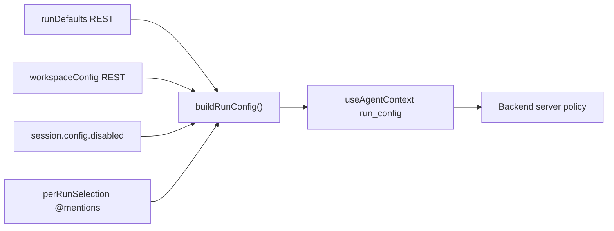
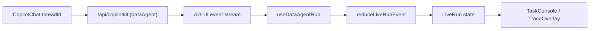

# Data Agent Session Page — Design

> **Last verified against code:** 2026-06-24  
> **Maintenance:** When changing `TaskConsole`, layout/responsive behavior, config
> REST integration, or design tokens, update this document in the same change.

This page (`/data-tasks`) is a **data-agent workbench** built on CopilotKit v2
(`@copilotkit/react-core/v2`). It is a **real frontend**: it talks to the live
`dataAgent` backend over the CopilotKit / AG-UI protocol and renders only what
the backend actually streams. There is no mock scenario or scripted demo.

The backend protocol surface is the source of truth for what is renderable; see
[copilotkit-ag-ui-frontend-protocol.md](../../../../../docs/engineering/copilotkit-ag-ui-frontend-protocol.md).
This document describes how the page maps that protocol to UI.

## Layout

Three-column responsive grid, driven by
[workspace-layout.ts](./workspace-layout.ts) rather than static Tailwind
breakpoints:

```
expanded: 320px minmax(400px, 1fr) 400px
collapsed-left: 56px minmax(400px, 1fr) 400px
config-panel-open: 320px minmax(400px, 1fr)
```

- **Left — `SessionPane`**: workspace default config rows (DB/KB/MCP/LLM/Skill,
  opening `WorkspaceConfigPanel`), the cross-session「工作区文件」asset entry,
  and the client-side session list.
- **Middle — `ChatPane`**: a stock `CopilotChat` bound to the active session's
  `threadId`, the inline tool-call trace cards, the HITL interrupt renderer, and
  the data-task welcome screen for an empty thread.
- **Right — `TaskConsole`**: a tabbed data-task console with four tabs —
  Overview / Trace / Outputs / Detail — derived from the live run. The Detail
  tab is selection-driven: clicking a tool card in the middle column (or a
  trace entry) auto-switches to it.

Layout behavior:

- Left panel width is `LEFT_PANEL_WIDTH_EXPANDED = 320`; collapsed width is
  `LEFT_PANEL_WIDTH_COLLAPSED = 56`.
- Right panel width is persisted and draggable via `usePanelResize`; it defaults
  to `RIGHT_PANEL_DEFAULT_WIDTH = 400` and is clamped to `320–640`.
- The middle column reserves `CHAT_MIN_WIDTH = 400`; chat input sizing separately
  reserves `CHAT_INPUT_PREFERRED_WIDTH = 768` plus `32` px horizontal padding.
- `resolveResponsiveSidebars` applies viewport pressure in this order: close the
  right console first, then collapse the left panel. User preferences are
  restored when space returns.
- When the viewport cannot fit a docked right panel (`canDockRightPanel` in
  [workspace-layout.ts](./workspace-layout.ts)), `TaskConsole` opens in
  [TaskConsoleDrawer.tsx](./components/task-console/TaskConsoleDrawer.tsx)
  (full-screen overlay, Esc / backdrop dismiss) instead of the grid column. The
  chat header「打开控制台」button opens the drawer on narrow viewports.
- Opening `WorkspaceConfigPanel` makes the workspace two-column: left config
  library + middle/config content. The right `TaskConsole` is hidden while a
  config panel is open.

## Workspace configuration model (DB / KB / MCP / LLM / Skill)

State + schema live in [data-task-state.ts](./data-task-state.ts); UI lives in
[page.tsx](./page.tsx). Backend config I/O is handled by
[use-workspace-config-api.ts](./hooks/use-workspace-config-api.ts), which wraps
`lib/config-api`. The backend-side contract and the capability gap list:

- [config-management-api.md](../../../../../docs/engineering/config-management-api.md)
  — REST contract for config management and the **`run_config` merge model**
  section (server-side merge of workspace defaults, session overrides, and per-run
  selections).
- [2026-06-25-backend-requirements.md](../../../../../docs/engineering/2026-06-25-backend-requirements.md)
  — what the frontend needs the backend to implement, prioritized.
- [2026-06-25-frontend-capability-status.md](../../../../../docs/engineering/2026-06-25-frontend-capability-status.md)
  — the current frontend-side capability/gating state.

### Three-layer resolution

The left panel is the **static resource library**; the chat input carries two
more layers before a run is dispatched.

```
effectiveRunConfig = merge(workspaceDefaults, sessionEnabled, perRunMentioned, serverPolicy)
```

1. **Workspace defaults (left panel)** — DB / KB / MCP / LLM / Skill entries are
   *static defaults*. Every entry is **default-available**; there are **no
   per-item enable toggles**. Wording is "工作区默认配置 / 默认可用", never
   "本轮启用/禁用". The list is loaded from the config REST API
   (`getWorkspaceConfig`) after `getCapabilities`; failed loads fall back to
   `defaultWorkspaceConfig()` so the UI can still render a safe local shape.
2. **Session config (chat input bottom pills)** — `SessionConfigBar` shows four
   per-kind pills (`数据源 / 知识库 / MCP / 技能`) with `启用数/总数`. Clicking a
   pill opens an upward popover with a switch list to disable specific resources
   for **this chat session only**. Stored as a per-session *disabled* list on
   `ChatSession.config.disabled` (default = all workspace resources enabled; new
   resources added to the left panel auto-appear in old sessions). Persisted in
   `localStorage` (`data-tasks:sessions:v1`). See
   [§Session config pills](#session-config-pills-layer-2).
3. **Per-run `@` mentions (chips above textarea)** — Cursor-style `@` to **name**
   resources/files for this single run. DB/KB/MCP/Skill are pickable only from the
   session-enabled set. The unified `@file` menu includes current-session
   file-backed artifacts and cross-session workspace files. Resource `@` sets
   `active*` + `mentioned` in `run_config`; workspace-file `@` sets `fileIds`;
   current-session artifact `@` sets `pinnedPaths` (forward-compatible, currently
   labeled「后端未支持」until backend support lands). Cleared after send. See
   [§Per-run `@` mentions](#per-run--mentions-layer-3).
4. **Server policy (backend)** — the final authority; merges the above with
   permission/policy. The frontend always sends the forward-compatible
   `run_config`; backend support is discovered through runtime capabilities and
   tracked in [2026-06-25-backend-requirements.md](../../../../../docs/engineering/2026-06-25-backend-requirements.md).

LLM model selection stays in `ChatModelPicker` (not a session pill).

### Build ahead of the backend — but label it honestly

Earlier this page hid anything the backend could not yet consume. That rule is
**relaxed**: the frontend MAY ship UX ahead of the backend **as long as**

1. the requirement is a reasonable ask of the backend, and is written down in
   [2026-06-25-backend-requirements.md](../../../../../docs/engineering/2026-06-25-backend-requirements.md);
2. nothing the user sees implies an effect the backend can't deliver — anything
   inert is surfaced with a 「后端未支持」 hint (the `ConfigRow` `unsupported`
   badge, the `@` menu/chip badge, etc.); and
3. the data it produces is **forward-compatible** (ids/selections only, no
   secrets) so wiring the backend later is a no-op on the protocol.

Concretely, the `@` picker lets a run select `@db` / `@kb` / `@mcp` / `@skill`.
Each option is filtered by the session-enabled resource set and runtime
capabilities. Unsupported kinds still ride along in `run_config` with a visible
「后端未支持」 marker until the corresponding backend capability lands.

For per-field config the visible set is still **grounded in the backend's
verified Data Gateway capability**; speculative fields stay gated-off (see
[§Capability gating](#capability-gating-forward-compatible-flip-a-flag)) and
their full contract lives in `config-management-api.md`.

| Config | UI exposes today | Capability key → runtime behavior |
| --- | --- | --- |
| DB | REST-backed CRUD / test / introspect, `datasourceId`, file adapters, readonly mode | `runDefaults.defaultDatasourceId` chooses default; `datasource.server` unlocks server adapter fields; `datasource.queryPolicy` unlocks maxRows/timeoutMs |
| KB | REST-backed CRUD, file upload, reindex job, search-facing settings | `knowledge` must be true for runtime KB retrieval; UI marks unsupported paths |
| MCP | REST-backed CRUD + test + manifest-oriented settings | `mcp` must be true for runtime MCP mount; UI marks unsupported paths |
| LLM | REST-backed model profiles, test, `activeLlmProfileId` in `run_config` | Per-run profile switching depends on backend honoring `activeLlmProfileId`; `llm.samplingParams` unlocks temperature/maxTokens fields |
| Skill | REST-backed upload/replace/validate for `SKILL.md` / `.zip` packages | `skills` must be true for runtime skill strategy; UI marks unsupported paths |

### Field schema system (`data-task-state.ts`)

`WORKSPACE_CONFIG_FIELDS[kind]` is a list of `ConfigFieldDef`. A field can be:

- `required` — enforced by `isWorkspaceConfigItemValid` (used to gate "create").
- `visibleWhen(settings)` — **conditional field** (e.g. DB `filePath` shows only
  for file types; server fields only for server types).
- `requiresCapability` — **capability-gated** (see below).
- `readOnly(item)` — e.g. builtin core fields, forced `mode=readonly`.

`visibleConfigFields(kind, settings)` applies the capability + `visibleWhen`
filter; the detail view and validation both use it, so they stay consistent.

### Capability gating (forward-compatible, flip-a-flag)

Backend capabilities are loaded at runtime via `configApi.getCapabilities()` and
applied through `setLiveBackendCapabilities`; `hasCapability()` gates fields via
`requiresCapability`. Deleted/aspirational fields are **kept in the schema as
gated-off** so restoring them is a backend capability flip, not a re-author:

| capability flag | unlocks when backend ships | gated fields |
| --- | --- | --- |
| `datasource.server` | PostgreSQL / MySQL adapters (#2) | DB type options + host/port/database/schema/username/password |
| `datasource.queryPolicy` | env `SQL_*` wired into Gateway (#5) | DB maxRows / timeoutMs |
| `llm.samplingParams` | per-run sampling consumed (#4) | LLM temperature / maxTokens |

### Credentials never cross the AG-UI protocol

API keys / tokens / passwords are never embedded in AG-UI context. Config REST
create/update calls may send credentials in HTTPS request bodies; list/detail
responses map backend `secretRef` / `hasSecret` into `WorkspaceConfigItem` and do
not expose plaintext secrets. The embedded `workspaceConfig` is still sanitized
by `sanitizeWorkspaceConfig` before entering run context, so the stream only
carries ids, flags, and non-secret settings.

### Run config merge flow



Priority (highest wins for active selections, lowest for defaults):

1. **Per-run `@` mentions** — `mentioned.*` and `activeDatasourceId` / `activeSkillId`
   when the user explicitly `@`-picked resources for this send.
2. **Session disabled list** — subtracts resources from the enabled sets for this
   chat thread only (`ChatSession.config.disabled`).
3. **Workspace defaults** — full resource library from REST (`getWorkspaceConfig`).
4. **`runDefaults` (REST)** — server-provided `defaultDatasourceId` /
   `activeLlmProfileId` used when the frontend has no explicit per-run choice.
5. **Server policy** — backend may further filter or ignore unsupported keys based
   on `getCapabilities()` flags; unsupported keys remain forward-compatible in the
   payload.

### Run context sent today

Two `useAgentContext` items (+ `forwardedProps.datasourceId`):

- `datasource_id` — the one field the backend currently honors (protocol §2).
- `run_config` — single forward-compatible payload built by `buildRunConfig`
  matching the **`run_config` merge model** in
  [config-management-api.md](../../../../../docs/engineering/config-management-api.md);
  **ids / selections only, no secrets**:

```jsonc
{
  "enabledDatasourceIds": [...],   // session-enabled set (all available)
  "enabledKnowledgeIds": [...],
  "enabledMcpServerIds": [...],
  "enabledSkillIds": [...],
  "activeDatasourceId": "...",     // first @db mention, else default
  "activeLlmProfileId": "...",
  "activeSkillId": "...",
  "mentioned": {                   // this run's @ resource picks (subset of session-enabled)
    "db": [...], "kb": [...], "mcp": [...], "skill": [...]
  },
  "fileIds": [...],                // @ 工作区文件：backend already materializes to input/
  "pinnedPaths": [...]             // @ 本对话产物：backend pending; prompt-only pin
}
```

Backend consumption of `run_config` is capability-driven: unsupported keys remain
forward-compatible payload only, while supported keys are consumed by server
policy. A third `当前数据任务工作区状态` item carries sanitized workspace state for
debugging.

### Session config pills (layer 2)

`SessionConfigBar` (`components/chat/SessionConfigBar.tsx`) sits at the **bottom**
of the chat input card (below the textarea row, above the card border). It is the
session-scoped enablement layer between the left-panel library and per-run `@`.

- **Pills**: one per kind (`db/kb/mcp/skill`), label + `启用数/总数`; kb/mcp/skill
  carry a compact 「未支持」 badge.
- **Popover**: click a pill → upward list with name + switch. Off = id appended to
  `ChatSession.config.disabled[kind]`. On = removed from disabled list.
- **Storage**: per-session in `data-tasks:sessions:v1`. Omitted `config` = all
  workspace resources enabled for that session.
- **Effect on run**: `buildRunConfig` sets each `enabled*Ids` to the
  session-enabled id list. Disabling a resource in session removes it from
  availability for that session's runs and from the `@` picker.
- **Pruning**: disabling a resource also drops it from `perRunSelection` chips.

### Per-run `@` mentions (layer 3)

A Cursor-style `@` picker lets one run **name** resources from the session-enabled
set. `@` is **specify / prioritize**, not **restrict** — other session-enabled
resources stay in `enabled*Ids` and remain available to the agent.

- **Scope**: `@db` / `@kb` / `@mcp` / `@skill` / `@file`. LLM excluded (`ChatModelPicker`).
  (`/` commands reserved; CopilotKit owns `/` for `toolsMenu`.)
- **Trigger**: typing `@` at a word boundary, or the `@` toolbar button
  (`openAtCaret`). Menu lists **session-enabled** resources only; ↑/↓, Enter/Tab,
  Esc.
- **Wiring** (`chat-mentions.tsx`): native capture-phase `keydown` on the textarea;
  text rewrite via native value setter + `input` event.
- **State**: `perRunSelection` in `page.tsx`; chips above textarea; pruned when
  workspace items are deleted or session-disabled.
- **Effect**: `enabled*Ids` = session set (unchanged by resource `@`). `activeDatasourceId`
  / `activeSkillId` = first `@` mention for that kind, else default.
  `mentioned` = full resource `@` pick list. `@file` splits by scope: workspace
  files write `run_config.fileIds` and are already consumed by the backend; current
  session artifacts write `run_config.pinnedPaths` and are labeled「后端未支持」
  until backend consumes the pin list. Runtime effect is capability-driven; a kind
  that the backend cannot honor remains a labeled, forward-compatible selection
  per [§Build ahead of the backend](#build-ahead-of-the-backend--but-label-it-honestly).
- **Lifetime**: per-run only; cleared after send via `BoundDataTaskChatInput`.

### Chat file attachments (dialog upload)

The chat input supports file attachments via CopilotKit v2 `useAttachments`, wired in
`StableDataTaskChatInput` (`page.tsx`) and rendered in `DataTaskChatInput`:

- **UI**: paperclip button, drag-and-drop overlay, clipboard paste (scoped to input
  container), and `AttachmentChips` above the textarea (filename, size, status, remove).
- **Modality split** (`chat-attachments.ts`):
  - Images (png/jpg/webp/gif) → default base64 inline as AG-UI `InputContent`.
  - Data/text files (csv/tsv/xlsx/json/parquet/txt/pdf) → `onUpload` to
    `POST /api/v1/chat/uploads` (when backend supports it).
- **Submit path**: when attachments are present, `consumeAttachments()` →
  `buildMessageContent()` → `agent.addMessage` + `copilotkit.runAgent`; otherwise
  the stock `onSubmitMessage` path is unchanged.
- **Capability gating**: `chat.imageInput` / `chat.fileUpload` from
  `getCapabilities()`. When false, the chip shows 「后端未支持」 and the attachment
  is **not** included in the outgoing message (text still sends). Backend requirement
  tracked as capability #13 / backlog O-007.

## Backend wiring (the real data flow)



- The `CopilotKit` provider points at `NEXT_PUBLIC_AGENT_RUNTIME_URL`
  (default `http://127.0.0.1:8787/api/copilotkit`) with `agentId="dataAgent"`.
- [use-data-agent-run.ts](./use-data-agent-run.ts) subscribes to the agent and
  reduces the AG-UI stream into a `LiveRun` via
  [live-run-state.ts](./live-run-state.ts).
- Events consumed: `RUN_STARTED/FINISHED/ERROR`, `STATE_SNAPSHOT/DELTA`,
  `ACTIVITY_SNAPSHOT/DELTA` (plan + step), `TOOL_CALL_*`, and
  `CUSTOM` (`sql_audit`, `artifact`, `token_usage`, `workspace.metadata`,
  `sandbox.output`). Text and reasoning are rendered by the stock `CopilotChat`.
- Timeline events use a **tool-agnostic** `DataStepKind`
  (`inspect | query | transform | fetch | visualize | knowledge | other`),
  mapped from the tool name by `dataStepKindForTool`. Today the backend only
  emits `inspect` (`inspect_schema`) and `query` (`run_sql_readonly`); any other
  tool degrades to a generic `other` step instead of masquerading as a schema
  inspection, so non-SQL data scenarios slot in without re-architecture.

### datasource selection

The selected datasource is resolved from config API state, then sent two ways for
redundancy, matching the protocol priority order:

- `CopilotKit properties={{ datasourceId }}` → AG-UI `forwardedProps.datasourceId`
  (highest priority the protocol honors from the client).
- `useAgentContext({ description: "datasource_id", value })` as a fallback.

The default comes from `useWorkspaceConfigApi().runDefaults.defaultDatasourceId`
when available. If the config API is unavailable, the page falls back to the
first visible datasource in `workspaceConfig.db` (ultimately the local default
store shape), so the UI no longer hardcodes `api-duckdb-demo` as the only
datasource.

## Sessions (client-side threads)

The backend has no session list or persistence API — only a per-run `threadId`.
Sessions are therefore managed entirely on the client:

- Each session owns its own `threadId` (`crypto.randomUUID()`); the list is
  persisted in `localStorage` (`data-tasks:sessions:v1`).
- `useAgent` / `CopilotChat` cache a per-`(agentId, threadId)` agent clone, so
  switching `threadId` gives each session isolated messages and run state.
- `useDataAgentRun` resets its `LiveRun` whenever `threadId` changes.
- New session = push a new `threadId`; switching = change the active id.

`useThreads` (durable Intelligence threads) is intentionally **not** used: it
requires the runtime in Intelligence mode, which this backend does not run.

## Auxiliary UI modules

Several page-level modules sit outside the three primary panes but are part of
the `/data-tasks` product surface:

- **`DataTaskWelcomeScreen`** (`components/chat/DataTaskWelcome.tsx`) — rendered
  as the empty-thread welcome screen for `CopilotChat`. It introduces the data
  workbench, shows example prompts, and displays the active datasource chip.
- **`CollaborationInterruptHandler`**
  (`components/chat/CollaborationInterruptHandler.tsx`) — registers
  `useInterrupt` for Mastra `ask_user` and `submit_plan` suspensions. It renders
  structured choice rows, free-text answers, and plan approval/rejection UI,
  scoped to the active `agentId` + `threadId`.
- **`JobProgressBanner`** (`components/JobProgressBanner.tsx`) — shown inside
  `WorkspaceConfigPanel` for asynchronous config jobs such as datasource
  introspection and knowledge reindexing. It polls via `useWorkspaceConfigApi`,
  supports cancellation, and auto-dismisses terminal states.

## TaskConsole mapping

Organized around the data-task lifecycle (not around tools): what was asked →
how the agent moved data → can it be trusted → what can be taken away. Four tabs
(Overview / Trace / Outputs / Detail) own one granularity each so nothing is
duplicated. An **action** `selection` (from a middle-column tool card or a trace
entry) auto-switches to the Detail tab via a `useEffect`; clicking any non-Detail
tab clears the selection. Artifact clicks stay on **产出** and expand in-place.

- **Overview tab** —
  - `ConclusionZone`: current question (the latest user message via
    `useDataAgentRun().latestQuestion`), error state when present, and
    **tool-agnostic** KPI cards: 步骤数 / 成功率 / 产出 / Token·成本. Runtime
    status and duration live only in the console header so the Overview does not
    repeat chrome-level state. The Token/成本 KPI is only lit when the backend
    emits `CUSTOM(name="token_usage")`; otherwise it keeps a compact
    「待上报」 hint. No SQL-specific headline numbers are shown here (those are
    per-step, shown in Trace/Detail).
  - `DynamicStepsList`: the progress checklist is derived from the **real**
    executed `liveRun.toolCalls` (not the hardcoded backend `ACTIVITY` plan), so
    new backend tools appear automatically. Each step shows `dataStepLabel`, a
    step-kind color rail (`stepKindTone`), a status dot (running/success/failed),
    and single-step duration; running rows use the existing `.step-streaming`
    pulse. Clicking a step opens its Detail. The reducer still keeps
    `liveRun.plan`, but the UI no longer renders it.
  - Low-frequency diagnostics use the shared collapsible `ConsoleSection`
    pattern instead of staying fully expanded in the default view:
    `RunConfigurationZone` is collapsed when the backend has not emitted
    `run.config.resolved`, `skill.selection`, `goal.updated`, or `context.*`
    signals, then auto-opens when those signals arrive; `WorkspaceRunSignalsSummary`
    appears only when `workspace.metadata` / `sandbox.output` events exist and is
    collapsed by default; `ToolDistributionZone` remains hidden with no tool
    calls and is collapsed by default when present.
- **Trace tab (`EvidenceZone`)** — the chronological evidence chain rendered by
  the shared `TraceList` from `buildTraceTimeline`; each card carries that step's
  duration/rows inline (per-step granularity). A `放大全屏` button opens the same
  content in `TraceOverlay`.
- **Outputs tab (`DeliverablesZone`)** — the current-session artifact shelf, fed by
  `CUSTOM(artifact)` (tab badge = artifact count). Clicking a card **expands
  inline** in this tab (dataset/SQL/chart/report preview via `ArtifactDetailView`);
  it does not jump to Detail. When `createdByEventId` is known, an optional
  「来源步骤 → 在详情中查看」 link opens the producing step in Detail. Export/download
  is gated behind `artifact.export` (#9) as a labeled placeholder. File-backed
  artifacts also expose inline actions: download, `@ 引用`, and「加入工作区」.
  「加入工作区」is gated behind `artifact.promote`; once supported it creates the
  right-to-left bridge from temporary session output to cross-session workspace
  asset. Cross-session workspace files no longer live in Outputs; they are managed
  from the left「工作区文件」resource entry.
- **Detail tab** — selection-driven for **steps/actions only**. For an action it
  shows single-step duration + status (from the matching `toolCall`), reasoning,
  action detail (inspect/query/generic), per-step usage, and produced-artifact
  lineage (expand inline). Per-step usage is resolved by
  `resolveTokenUsageForEvent`: it matches `token_usage` by `tool_call_id`,
  `step_id`, or 1-based `step_number`, then renders input/output Token bars,
  model chips, and optional `cost_usd`. If no matching event exists, the panel
  explicitly shows 「后端未支持」 instead of fabricating numbers. With no selection
  it shows an empty prompt to pick a step.
- **Full trace (`TraceOverlay`)** — the same evidence chain as a full-screen
  overlay for focused triage when the chat result is missing.

The middle→right linkage for steps is via the right console itself: click a step
in **概览** progress list or **追溯** timeline to open the Detail tab.

## Design tokens and visual semantics

The workbench uses Tailwind v4 CSS variables from [globals.css](../globals.css)
and shared class bundles from [ui-tokens.ts](./ui-tokens.ts). New UI should prefer
semantic tokens over hardcoded `slate-*` / `blue-*` colors so the dense dashboard
can evolve consistently.

- **Base palette:** `--primary`, `--primary-light`, `--accent`, `--surface`,
  `--surface-subtle`, `--border`, `--foreground`, `--muted`, `--muted-light`,
  and `--code-bg`.
- **Step tones:** `--step-inspect`, `--step-query`, `--step-transform`,
  `--step-fetch`, `--step-visualize`, `--step-knowledge`, plus success/warning/
  error. `stepKindTone(kind)` maps `DataStepKind` to `bg` / `border` / `text` /
  `bar` / `ring` classes and is used by the progress list, trace entries, and
  tool distribution mini bars.
- **Artifact tones:** `artifactToneForType(type)` maps
  `dataset | sql | chart | report | file` to the closest step tone and a compact
  visual label/icon. Outputs and trace artifact chips should use this helper
  instead of ad hoc colors.
- **KPI typography:** `kpiValueClass` is reserved for right-console headline
  numbers; normal metric cards keep `metricValueClass`.
- **HITL choices:** `choiceOptionClass`, `choiceOptionIconClass`, and
  `choiceOptionChevronClass` style `ask_user` / `submit_plan` options rendered by
  `CollaborationInterruptHandler`.
- **Status tones:** `statusTone(success|error|info|warning|muted)` for banners,
  job progress, trace overlay status pills, and tool-result status badges.
  `overlayBackdropClass` / `overlayPanelClass` standardize drawer and modal shells
  (`TaskConsoleDrawer`, `TraceOverlay`).
- **Token usage contract:** [2026-06-25-backend-requirements.md R-002](../../../../../docs/engineering/2026-06-25-backend-requirements.md#r-002-llm-token-用量上报)
  defines `CUSTOM(name="token_usage")`. Besides `input_tokens` /
  `output_tokens`, the frontend consumes `tool_call_id`, `step_id`, `model`, and
  optional `cost_usd` for the Overview KPI and Detail usage panel. `step_number`
  is a **last-resort fallback** only when ids are absent; matches are labeled
  「近似」 in the Detail panel.

## Backend-unsupported affordances (kept as labeled placeholders)

These exist in the UI for shape/affordance but are explicitly marked
**后端未支持** (the `ConfigRow` `unsupported` badge, `@` menu/chip badge, or
console usage hint) when runtime capabilities say the backend cannot honor them:

- **KB / MCP / Skill runtime use** — resources are REST-backed in the config UI,
  but agent runtime behavior still depends on the corresponding backend
  capability. Unsupported rows and mentions remain visible, labeled, and
  forward-compatible through `run_config`.
- **LLM model picker** (`ChatModelPicker`) — selects an `activeLlmProfileId`
  client-side and ships it in `run_config`; actual per-run switching depends on
  backend model-profile support (#4).
- **Step-level Token / model / cost** — the right console can render
  `token_usage` details when the backend emits them. Without those events, the
  Detail usage panel shows 「后端未支持」 and the Overview KPI stays in `待上报`.
- **Artifact export/download** — the Deliverables zone reserves the affordance
  behind the `artifact.export` flag; backend support is tracked by #9.
- **Artifact list/promote and pinned paths** — session artifact restore,
  「加入工作区」, and current-session `@file` pinning are forward-compatible UI.
  They are labeled or no-op until `artifact.list`, `artifact.promote`, and
  `runConfig.pinnedPaths` land in the backend.
- **Chat file attachments** — UI is complete (select/drag/paste/chips). Image inline
  and data-file upload require `chat.imageInput` / `chat.fileUpload` (R-007).
  Until then, unsupported attachments are labeled and excluded from the run payload.

## Deferred (not in this delivery)

- `/` slash commands for run-level **actions** (e.g. `/clear`, `/export`); the
  `@` mention picker (layer 2 resource selection) has shipped.
- Backend-gated runtime behaviors — see runtime capabilities and
  `2026-06-25-backend-requirements.md`; the UI can expose forward-compatible
  controls, but must label anything the backend cannot honor yet.
- secretRef hardening and multi-user workspace isolation as the backend
  production path matures.
- Artifact preview/download once #9 is fully enabled by the backend capability.
