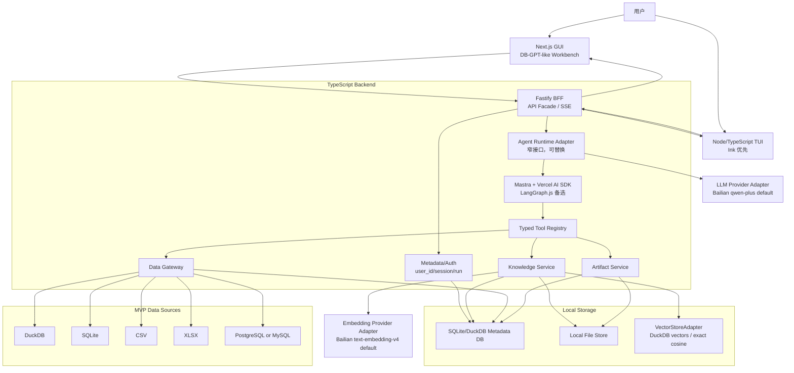

# DB-GPT-like Data Agent 最终研发设计文档

日期：2026-06-16
状态：研发最终设计 / 10 天 MVP 交付版
主 PRD：[`docs/prd/db-gpt-like-data-agent-prd-plan-zh.md`](../prd/db-gpt-like-data-agent-prd-plan-zh.md)
英文同步 PRD：[`docs/prd/db-gpt-like-data-agent-prd-plan.md`](../prd/db-gpt-like-data-agent-prd-plan.md)

## 1. 研发判断与修正建议

### 1.1 已确认边界

本设计以中文 PRD 为准。PRD 当前技术边界是合理的，没有发现必须推翻的冲突：

- 不把 OpenCode 作为核心 runtime 强绑定。
- 采用 TypeScript-first 架构。
- 首选 Mastra + Vercel AI SDK + 自研 Data Gateway。
- 保留 Agent Runtime Adapter，允许后续替换 LangGraph.js 或其他 runtime。
- TUI 是外部用户正式入口，不是 debug 工具。
- 用户级知识隔离是默认安全边界。
- 默认模型是阿里云百炼 Qwen 聊天模型，默认可用 `qwen-plus`。
- 默认嵌入模型是阿里云百炼 `text-embedding-v4`，默认 1024 维 dense 向量。
- 10 天 MVP 不追求 DB-GPT 后端完整兼容。

### 1.2 研发修正建议

以下是研发落地时需要明确的收敛建议，不改变产品边界：

- PostgreSQL/MySQL 在 10 天内建议二选一。优先选择团队最熟的数据源；若样本演示用 DuckDB/SQLite 已足够，服务器数据库可以降级为 P1。
- DOCX 支持可以通过文本抽取实现；旧 `.doc` 不进入 MVP。
- PDF 只支持文本型 PDF；扫描 PDF/OCR 不进入 MVP。
- DuckDB VSS 不作为硬依赖。先实现 `VectorStoreAdapter`，底层优先 DuckDB 表存向量；VSS 不稳定时使用 exact cosine。
- 桌面封装不作为阻塞项。默认交付本地 Web + TUI。
- TUI 不做管理后台，只做登录/识别、session、上下文选择、运行、流式轨迹、SQL/引用展示、artifact 访问。

## 2. 技术方案总览

### 2.1 目标

在 10 天内交付一个可演示、可复跑的 DB-GPT-like 数据智能体工作台：

- Web GUI 保留 DB-GPT-like 桌面工作台体验。
- TUI 作为正式入口复用同一后端链路。
- Agent runtime 负责规划和工具调用，但不直接访问数据库凭据。
- Data Gateway 负责所有数据源接入和 SQL 安全。
- Knowledge Service 负责用户级文档上传、索引、检索、引用。
- Artifact Service 负责表格、图表、Markdown、HTML 和文件产物。

### 2.2 最终架构图



### 2.3 运行主流程

1. Web GUI 或 TUI 获取当前用户身份。
2. 用户选择或创建 session。
3. 用户选择 datasource 和 knowledge collection。
4. 用户发起问题，BFF 创建 `run`。
5. BFF 通过 Agent Runtime Adapter 启动运行。
6. Adapter 将可用工具注册给 Mastra runtime。
7. runtime 通过工具调用 Knowledge Service 和 Data Gateway。
8. BFF 将 plan、step、SQL、引用、artifact 等事件以 SSE 流式返回给 GUI/TUI。
9. Artifact Service 保存产物并返回 artifact ID/download URL。
10. `run_events` 记录完整轨迹，供 session resume 和审计使用。

## 3. 2 人研发分工

### 3.1 研发 A：前端 / TUI / BFF

负责用户入口和 API 外观：

- Next.js GUI 工作台：
  - Agentic Data 首页
  - 对话工作台
  - 左侧 ReAct timeline
  - 右侧 artifact 面板
  - datasource/knowledge/model/context picker
- TUI：
  - Ink 方案验证
  - 登录/用户识别
  - session list/resume
  - datasource/knowledge 选择
  - prompt 输入
  - SSE trace 渲染
  - artifact 链接展示
- Fastify BFF：
  - auth/me/login/logout
  - session/run API
  - SSE endpoint
  - artifact download API
  - GUI/TUI 共用 DTO
- 前后端集成验收：
  - 事件流渲染
  - 错误态
  - loading/empty state
  - unsupported option disabled state

### 3.2 研发 B：Agent / Data Gateway / Knowledge

负责核心能力和安全边界：

- Agent Runtime Adapter：
  - Mastra 首版接入
  - 统一 tool contract
  - SSE event mapper
  - provider adapter
- Data Gateway：
  - datasource registry
  - DuckDB/SQLite/CSV/XLSX
  - PostgreSQL 或 MySQL 二选一
  - schema inspect
  - preview table
  - read-only SQL guard
  - row limit / timeout / audit log
- Knowledge Service：
  - collection/document/chunk 模型
  - PDF/TXT/Markdown/DOCX 解析
  - chunking
  - Bailian embedding adapter
  - VectorStoreAdapter
  - retrieve_knowledge
  - delete/invalidate
- Artifact Service：
  - table artifact
  - chart artifact
  - markdown/html report artifact
  - file export

### 3.3 共同责任

- 每天固定一次 demo rehearsal。
- 保持 API contract 不随 runtime 框架变化。
- 所有用户级资源查询必须带 `user_id`。
- 所有 SQL 执行必须经过 Data Gateway。
- Day 7 前必须打通旗舰 demo 的第一条端到端链路。

## 4. 推荐技术栈

### 4.1 前端 GUI

- Next.js + React + TypeScript。
- UI 复用 DB-GPT-like 工作台结构。
- Ant Design/Tailwind 可按现有原型选择，优先速度。
- 图表展示可用 ECharts、AntV 或轻量 chart renderer。

### 4.2 TUI

- Node.js + TypeScript。
- 优先评估 Ink。
- 若 Ink 集成耗时，降级为 Commander + prompts + readline 流式输出。
- TUI 必须通过 BFF API 工作，不直接调用 runtime/Data Gateway。

### 4.3 BFF

- Fastify + TypeScript。
- 原因：启动快、SSE 易实现、插件生态足够、适合 10 天 MVP。
- NestJS 可作为团队偏好备选，但不建议为了框架结构增加启动成本。

### 4.4 Agent Runtime

- 首选 Mastra + Vercel AI SDK。
- 保留 `AgentRuntimeAdapter` 接口：
  - `startRun(input): AsyncIterable<RunEvent>`
  - `cancelRun(runId)`
  - `resumeRun(sessionId)`
- LangGraph.js 作为后续替换路径。
- OpenCode 只作为参考实现或可选工具执行器，不进入核心依赖链。

### 4.5 LLM Provider

默认配置：

```bash
LLM_PROVIDER=bailian
LLM_MODEL=qwen-plus
LLM_BASE_URL=https://dashscope.aliyuncs.com/compatible-mode/v1
LLM_API_KEY=...
```

Provider adapter 要求：

- OpenAI-compatible chat completions 优先。
- 隔离模型名、base URL、API key。
- 不在日志、TUI、run_events 中输出 API key。
- 后续可切换 OpenAI、DeepSeek、Qwen、本地模型。

### 4.6 Embedding Provider

默认配置：

```bash
EMBEDDING_PROVIDER=bailian
EMBEDDING_MODEL=text-embedding-v4
EMBEDDING_DIM=1024
EMBEDDING_OUTPUT_TYPE=dense
EMBEDDING_BASE_URL=https://dashscope.aliyuncs.com/compatible-mode/v1
EMBEDDING_API_KEY=...
```

要求：

- embedding 维度写入 collection/index 元数据。
- 检索时校验 collection 的 embedding dim 与当前配置一致。
- 若 dim 不一致，提示 reindex。

### 4.7 Data Gateway

- DuckDB：本地分析和 CSV/XLSX 中间计算层。
- SQLite：metadata 或 demo datasource。
- CSV/XLSX：通过文件上传注册为 dataset。
- PostgreSQL 或 MySQL：MVP 二选一。
- SQL parser/guard：先使用白名单 + parser 双保险；parser 不可靠时保守拒绝。

### 4.8 Vector Store

- `VectorStoreAdapter` 抽象必须存在。
- 底层优先 DuckDB 表存向量。
- DuckDB VSS 可选。
- 降级路径：小规模 exact cosine，适合演示和用户级小集合。

## 5. 模块边界

### 5.1 GUI

职责：

- 展示 DB-GPT-like 工作台。
- 管理 UI 状态和用户上下文选择。
- 消费 SSE run events。
- 展示 SQL、引用、artifact。

不负责：

- 直接访问数据库。
- 直接调用 LLM。
- 做跨用户权限判断。

### 5.2 TUI

职责：

- 作为正式用户入口。
- 复用 BFF auth/session/run/artifact API。
- 渲染流式 ReAct trace。
- 输出 artifact 链接或本地下载路径。

不负责：

- 管理数据源连接凭据。
- 直接执行 SQL。
- 复刻 Web 管理后台。

### 5.3 BFF

职责：

- 解析用户身份。
- 提供 GUI/TUI 共用 API。
- 创建 session/run。
- 转发和持久化 run events。
- 对外提供 SSE。
- 调用 Agent Runtime Adapter。

不负责：

- 直接拼 SQL。
- 直接解析文档。
- 直接保存明文凭据到日志。

### 5.4 Agent Runtime Adapter

职责：

- 屏蔽 Mastra/LangGraph.js/OpenCode 差异。
- 将 agent 内部事件转成统一 SSE event。
- 只暴露稳定 tool contract。
- 控制 run 生命周期。

不负责：

- 数据源凭据管理。
- SQL 安全策略最终裁决。
- 用户权限最终裁决。

### 5.5 Data Gateway

职责：

- datasource registry。
- 凭据加密/遮蔽。
- schema introspection。
- read-only SQL guard。
- row limit / timeout。
- CSV/XLSX/DuckDB/SQLite/PostgreSQL/MySQL adapter。
- SQL audit log。

不负责：

- LLM reasoning。
- GUI 状态。
- 跨用户资源授权之外的业务权限模型。

### 5.6 Knowledge Service

职责：

- collection/document/chunk/index 生命周期。
- 文件解析。
- chunking。
- embedding。
- retrieval。
- 引用元数据。
- 删除和索引失效。

不负责：

- 复杂 OCR。
- 企业级知识权限。
- 外部文档连接器。

### 5.7 Artifact Service

职责：

- 生成和保存 table/chart/report/file artifacts。
- 提供 preview/download。
- artifact 与 user/session/run 绑定。

### 5.8 Metadata/Auth

职责：

- 用户识别。
- session/run/event/artifact 持久化。
- 开发 token 或本地登录。
- 所有资源默认按 `user_id` 过滤。

## 6. 数据模型

MVP 可以使用 SQLite 作为 metadata store；若团队更熟 DuckDB，也可使用 DuckDB，但认证/session 类数据用 SQLite 更稳。所有时间使用 ISO string 或 epoch ms，所有 ID 使用 UUID。

### 6.1 users

```sql
CREATE TABLE users (
  id TEXT PRIMARY KEY,
  email TEXT UNIQUE,
  display_name TEXT,
  dev_token TEXT UNIQUE,
  created_at TEXT NOT NULL,
  updated_at TEXT NOT NULL
);
```

MVP 可以支持开发 token 登录。生产登录不在 10 天范围内。

### 6.2 knowledge_collections

```sql
CREATE TABLE knowledge_collections (
  id TEXT PRIMARY KEY,
  user_id TEXT NOT NULL,
  name TEXT NOT NULL,
  description TEXT,
  embedding_provider TEXT NOT NULL,
  embedding_model TEXT NOT NULL,
  embedding_dim INTEGER NOT NULL,
  embedding_output_type TEXT NOT NULL,
  status TEXT NOT NULL,
  created_at TEXT NOT NULL,
  updated_at TEXT NOT NULL
);
CREATE INDEX idx_knowledge_collections_user ON knowledge_collections(user_id);
```

隔离规则：所有 collection 查询必须带 `user_id`。

### 6.3 documents

```sql
CREATE TABLE documents (
  id TEXT PRIMARY KEY,
  user_id TEXT NOT NULL,
  collection_id TEXT NOT NULL,
  filename TEXT NOT NULL,
  mime_type TEXT NOT NULL,
  file_size INTEGER NOT NULL,
  file_path TEXT NOT NULL,
  status TEXT NOT NULL,
  error_message TEXT,
  chunk_count INTEGER DEFAULT 0,
  created_at TEXT NOT NULL,
  updated_at TEXT NOT NULL
);
CREATE INDEX idx_documents_user_collection ON documents(user_id, collection_id);
```

状态：`uploaded | parsing | indexing | ready | failed | deleted`。

### 6.4 knowledge_chunks

```sql
CREATE TABLE knowledge_chunks (
  id TEXT PRIMARY KEY,
  user_id TEXT NOT NULL,
  collection_id TEXT NOT NULL,
  document_id TEXT NOT NULL,
  chunk_index INTEGER NOT NULL,
  content TEXT NOT NULL,
  token_count INTEGER,
  source_label TEXT,
  page_number INTEGER,
  section_title TEXT,
  embedding_ref TEXT,
  status TEXT NOT NULL,
  created_at TEXT NOT NULL
);
CREATE INDEX idx_chunks_user_collection ON knowledge_chunks(user_id, collection_id);
CREATE INDEX idx_chunks_document ON knowledge_chunks(document_id);
```

`embedding_ref` 指向 VectorStoreAdapter 中的向量记录。

### 6.5 data_sources

```sql
CREATE TABLE data_sources (
  id TEXT PRIMARY KEY,
  user_id TEXT NOT NULL,
  name TEXT NOT NULL,
  type TEXT NOT NULL,
  config_json TEXT NOT NULL,
  credential_ref TEXT,
  description TEXT,
  status TEXT NOT NULL,
  last_test_at TEXT,
  created_at TEXT NOT NULL,
  updated_at TEXT NOT NULL
);
CREATE INDEX idx_data_sources_user ON data_sources(user_id);
```

`config_json` 不保存明文密码。连接串、token、password 必须进入 credential store 或本地加密字段，日志和 UI 永不输出。

### 6.6 sessions

```sql
CREATE TABLE sessions (
  id TEXT PRIMARY KEY,
  user_id TEXT NOT NULL,
  title TEXT,
  selected_datasource_id TEXT,
  selected_collection_id TEXT,
  created_at TEXT NOT NULL,
  updated_at TEXT NOT NULL
);
CREATE INDEX idx_sessions_user ON sessions(user_id);
```

### 6.7 runs

```sql
CREATE TABLE runs (
  id TEXT PRIMARY KEY,
  user_id TEXT NOT NULL,
  session_id TEXT NOT NULL,
  status TEXT NOT NULL,
  user_input TEXT NOT NULL,
  model_provider TEXT,
  model_name TEXT,
  datasource_id TEXT,
  collection_id TEXT,
  started_at TEXT NOT NULL,
  finished_at TEXT,
  error_message TEXT
);
CREATE INDEX idx_runs_user_session ON runs(user_id, session_id);
```

状态：`queued | running | completed | failed | canceled`。

### 6.8 run_events

```sql
CREATE TABLE run_events (
  id TEXT PRIMARY KEY,
  user_id TEXT NOT NULL,
  run_id TEXT NOT NULL,
  seq INTEGER NOT NULL,
  event_type TEXT NOT NULL,
  payload_json TEXT NOT NULL,
  created_at TEXT NOT NULL
);
CREATE UNIQUE INDEX idx_run_events_seq ON run_events(run_id, seq);
CREATE INDEX idx_run_events_user_run ON run_events(user_id, run_id);
```

run event 是 GUI/TUI resume 的事实源。

### 6.9 artifacts

```sql
CREATE TABLE artifacts (
  id TEXT PRIMARY KEY,
  user_id TEXT NOT NULL,
  session_id TEXT NOT NULL,
  run_id TEXT NOT NULL,
  type TEXT NOT NULL,
  name TEXT NOT NULL,
  mime_type TEXT,
  storage_path TEXT,
  preview_json TEXT,
  metadata_json TEXT,
  created_at TEXT NOT NULL
);
CREATE INDEX idx_artifacts_user_run ON artifacts(user_id, run_id);
```

类型：`table | chart | markdown | html | file | image | citation_bundle`。

## 7. API 合约

所有 API 默认需要用户上下文。MVP 可以用 `Authorization: Bearer <dev_token>` 或 cookie session。响应统一结构：

```ts
type ApiResult<T> = {
  success: boolean;
  data?: T;
  err_code?: string;
  err_msg?: string;
};
```

### 7.1 Auth

`GET /api/v1/me`

```ts
type MeResponse = {
  id: string;
  email?: string;
  display_name?: string;
};
```

`POST /api/v1/auth/login`

```ts
type LoginRequest = {
  email?: string;
  dev_token?: string;
};
type LoginResponse = {
  token: string;
  user: MeResponse;
};
```

### 7.2 Knowledge

`GET /api/v1/knowledge/collections`

返回当前用户 collection 列表。

`POST /api/v1/knowledge/collections`

```ts
type CreateCollectionRequest = {
  name: string;
  description?: string;
};
```

`POST /api/v1/knowledge/collections/{id}/upload`

- multipart form: `file`
- 支持：PDF、TXT、Markdown、DOCX。
- 返回 document 元数据。

`GET /api/v1/knowledge/collections/{id}/documents`

必须校验 collection 属于当前 `user_id`。

`DELETE /api/v1/knowledge/documents/{id}`

逻辑删除 document，同时删除或失效 chunks/vector refs。

`POST /api/v1/knowledge/retrieve`

```ts
type RetrieveKnowledgeRequest = {
  collection_id: string;
  query: string;
  top_k?: number;
};

type RetrievedChunk = {
  chunk_id: string;
  document_id: string;
  filename: string;
  content: string;
  score: number;
  page_number?: number;
  section_title?: string;
  source_label: string;
};
```

### 7.3 Data Gateway 外部 API

兼容 DB-GPT-like GUI 命名：

- `GET /api/v1/chat/db/list`
- `GET /api/v1/chat/db/support_type`
- `POST /api/v1/chat/db/test-connect`
- `POST /api/v1/chat/db/add`
- `POST /api/v1/chat/db/edit`
- `POST /api/v1/chat/db/delete`
- `POST /api/v1/chat/db/refresh`

`GET /api/v1/chat/db/support_type`

返回支持和禁用状态，禁用项仍返回给 GUI。

```ts
type SupportedDataSourceType = {
  name: "duckdb" | "sqlite" | "csv" | "xlsx" | "postgresql" | "mysql" | string;
  enabled: boolean;
  label: string;
  description?: string;
  parameters: ConfigurableParam[];
};
```

### 7.4 Agent Run SSE

`POST /api/v1/chat/react-agent`

```ts
type AgentRunRequest = {
  conv_uid?: string;
  session_id?: string;
  chat_mode: "chat_react_agent" | "chat_data" | "chat_excel" | "chat_knowledge" | string;
  model_name?: string;
  user_input: string;
  temperature?: number;
  max_new_tokens?: number;
  select_param?: string;
  ext_info?: {
    datasource_id?: string;
    database_name?: string;
    database_type?: string;
    collection_id?: string;
    knowledge_space_id?: string;
    file_id?: string;
    file_path?: string;
    connector_ids?: string[];
    skill_id?: string;
  };
};
```

响应：`text/event-stream`。

### 7.5 Artifact

`GET /api/v1/artifacts/{id}/download`

- 校验 artifact `user_id`。
- 文件型 artifact 返回二进制。
- table/chart/report 可返回 JSON/HTML/Markdown 或下载文件。

`GET /api/v1/files/{id}/preview`

用于 CSV/XLSX 上传预览。

## 8. SSE 事件协议

SSE 原始格式：

```text
data: {"type":"plan.update","run_id":"...","seq":1,"payload":{...}}

```

通用字段：

```ts
type RunEventEnvelope<T> = {
  type: string;
  run_id: string;
  session_id: string;
  seq: number;
  ts: string;
  payload: T;
};
```

### 8.1 plan.update

```ts
type PlanUpdatePayload = {
  tasks: Array<{
    id: string;
    title: string;
    status: "pending" | "running" | "completed" | "failed";
  }>;
};
```

### 8.2 step.start

```ts
type StepStartPayload = {
  step_id: string;
  title: string;
  kind: "knowledge" | "schema" | "sql" | "analysis" | "chart" | "report" | "tool" | "final";
  tool_name?: string;
};
```

### 8.3 step.meta

```ts
type StepMetaPayload = {
  step_id: string;
  status?: "running" | "completed" | "failed";
  input?: unknown;
  sql?: string;
  datasource_id?: string;
  collection_id?: string;
  citations?: Citation[];
};
```

### 8.4 step.output

```ts
type StepOutputPayload = {
  step_id: string;
  output_type: "text" | "markdown" | "json" | "table" | "chart" | "sql" | "citation" | "error";
  content: unknown;
};
```

### 8.5 step.chunk

用于流式文本。

```ts
type StepChunkPayload = {
  step_id: string;
  delta: string;
};
```

### 8.6 step.done

```ts
type StepDonePayload = {
  step_id: string;
  status: "completed" | "failed" | "canceled";
  error_message?: string;
  artifact_ids?: string[];
};
```

### 8.7 final

```ts
type FinalPayload = {
  content: string;
  citations?: Citation[];
  artifact_ids?: string[];
};
```

### 8.8 done

```ts
type DonePayload = {
  status: "completed";
  artifact_ids?: string[];
};
```

### 8.9 error

```ts
type ErrorPayload = {
  code: string;
  message: string;
  recoverable: boolean;
  step_id?: string;
};
```

### 8.10 cancel

```ts
type CancelPayload = {
  reason?: string;
};
```

### 8.11 Citation

```ts
type Citation = {
  document_id: string;
  chunk_id: string;
  filename: string;
  page_number?: number;
  section_title?: string;
  quote: string;
  score?: number;
};
```

## 9. Agent Tool Contract

所有 tool 入参都必须包含 `user_id`，但该字段由 BFF/Adapter 注入，不允许前端直接指定。tool 返回值必须可 JSON 序列化。

### 9.1 retrieve_knowledge

```ts
type RetrieveKnowledgeToolInput = {
  collection_id: string;
  query: string;
  top_k?: number;
};
```

约束：

- 只检索当前 `user_id` 下的 collection。
- 如果 collection 不存在或不属于用户，返回权限错误。

### 9.2 list_data_sources

```ts
type ListDataSourcesInput = {
  enabled_only?: boolean;
};
```

只返回当前用户可见 datasource，不返回凭据。

### 9.3 inspect_schema

```ts
type InspectSchemaInput = {
  datasource_id: string;
  table_names?: string[];
};
```

返回表、列、类型、样例行数和可用 schema 摘要。

### 9.4 preview_table

```ts
type PreviewTableInput = {
  datasource_id: string;
  table: string;
  limit?: number;
};
```

默认 `limit=20`，最大 100。

### 9.5 run_sql_readonly

```ts
type RunSqlReadonlyInput = {
  datasource_id: string;
  sql: string;
  limit?: number;
  timeout_ms?: number;
};
```

Data Gateway 必须：

- parse SQL。
- 只允许单条 statement。
- 只允许 SELECT/WITH/EXPLAIN 中安全子集。
- 拦截 INSERT/UPDATE/DELETE/DROP/ALTER/TRUNCATE/CREATE/MERGE/CALL/COPY/ATTACH/DETACH/PRAGMA 等高风险语句。
- 自动追加或包裹 row limit。
- 执行 timeout。
- 写 audit log。

### 9.6 profile_dataset

```ts
type ProfileDatasetInput = {
  datasource_id: string;
  table?: string;
  file_id?: string;
};
```

输出字段、行数估计、缺失值、top values、数值分布摘要。

### 9.7 create_chart

```ts
type CreateChartInput = {
  source_artifact_id?: string;
  table_data?: unknown;
  chart_type: "bar" | "line" | "pie" | "scatter" | "table";
  x?: string;
  y?: string;
  title?: string;
};
```

生成 chart artifact，优先返回可在 GUI 渲染的 JSON spec。

### 9.8 generate_report

```ts
type GenerateReportInput = {
  title: string;
  summary: string;
  artifact_ids?: string[];
  citations?: Citation[];
  format: "markdown" | "html";
};
```

### 9.9 export_artifact

```ts
type ExportArtifactInput = {
  artifact_id: string;
  format?: "json" | "csv" | "html" | "md" | "png";
};
```

## 10. Knowledge Pipeline

### 10.1 上传

1. 用户选择 collection。
2. 上传文件到 BFF。
3. BFF 校验文件类型和大小。
4. 文件保存到 `storage/{user_id}/knowledge/{document_id}/original`。
5. 写入 `documents`，状态 `uploaded`。
6. 异步或同步启动 parsing/indexing。10 天 MVP 可同步执行并展示状态轮询。

建议文件大小限制：

- 单文件默认 20 MB。
- 单 collection 默认 50 个文档以内。

### 10.2 解析

MVP parser：

- PDF：文本抽取。
- TXT/Markdown：直接读取文本。
- DOCX：抽取段落文本。

解析失败：

- document 状态置为 `failed`。
- 写入 `error_message`。
- UI/TUI 展示明确错误。

### 10.3 Chunk

建议策略：

- chunk size：800 到 1200 tokens。
- overlap：100 到 150 tokens。
- 保留 source metadata：filename、page_number、section_title。

### 10.4 Embedding

流程：

1. 读取 collection 的 embedding config。
2. 调用 Embedding Provider Adapter。
3. 校验输出维度等于 `embedding_dim`。
4. 写入 VectorStoreAdapter。
5. 更新 chunk `embedding_ref`。

### 10.5 VectorStoreAdapter

接口：

```ts
interface VectorStoreAdapter {
  upsert(input: {
    user_id: string;
    collection_id: string;
    document_id: string;
    chunk_id: string;
    vector: number[];
  }): Promise<void>;

  search(input: {
    user_id: string;
    collection_id: string;
    query_vector: number[];
    top_k: number;
  }): Promise<Array<{ chunk_id: string; score: number }>>;

  deleteByDocument(input: {
    user_id: string;
    document_id: string;
  }): Promise<void>;
}
```

降级：

- VSS 可用时使用向量索引。
- VSS 不可用时，读取当前用户 collection 向量，Node 内 exact cosine。
- MVP 数据规模可控，exact cosine 足够支持演示。

### 10.6 检索和引用渲染

检索流程：

1. 校验 collection 属于 user。
2. 计算 query embedding。
3. VectorStoreAdapter search。
4. 取回 chunks。
5. 返回 filename/page/section/quote/score。
6. 在 SSE `step.output` 中展示 citation。
7. final answer 包含引用。

### 10.7 删除和失效

删除 document：

- 校验 document 属于 user。
- document 状态置为 `deleted`。
- 删除或失效 chunks。
- 调用 VectorStoreAdapter 删除 document 向量。
- 不删除其他用户任何数据。

删除 collection：

- MVP 可以要求 collection 内无 ready document，或执行级联删除。
- 级联删除必须按 `user_id + collection_id` 双条件执行。

## 11. Data Gateway 安全边界

### 11.1 基本原则

- Agent 不持有凭据。
- Agent 不自由执行 SQL。
- SQL 最终执行权只在 Data Gateway。
- Data Gateway 所有操作带 `user_id`。
- Data Gateway 不返回密码、token、完整连接串。

### 11.2 SQL Guard

执行前检查：

1. trim 和 normalize。
2. 禁止多 statement。
3. parse SQL AST。
4. 只允许 SELECT/WITH。
5. 禁止危险 keyword。
6. 禁止写入型 function/procedure。
7. 注入 LIMIT。
8. 设置 timeout。

危险关键字最小黑名单：

```text
INSERT UPDATE DELETE DROP ALTER TRUNCATE CREATE REPLACE MERGE
CALL EXEC EXECUTE GRANT REVOKE COPY ATTACH DETACH PRAGMA
VACUUM ANALYZE SET RESET LOAD
```

说明：黑名单不是唯一防线，白名单和 parser 才是主防线。无法确认安全时拒绝执行。

### 11.3 Row Limit

- 默认 limit：100。
- GUI 预览最大：1000。
- Agent tool 最大：1000。
- 导出更大数据不进入 MVP。

### 11.4 Timeout

- 默认 SQL timeout：10 秒。
- demo 可配置到 30 秒。
- 超时返回结构化 error event。

### 11.5 Audit Log

建议增加 `sql_audit_logs`：

```sql
CREATE TABLE sql_audit_logs (
  id TEXT PRIMARY KEY,
  user_id TEXT NOT NULL,
  run_id TEXT,
  datasource_id TEXT NOT NULL,
  sql_text TEXT NOT NULL,
  status TEXT NOT NULL,
  blocked_reason TEXT,
  row_count INTEGER,
  elapsed_ms INTEGER,
  created_at TEXT NOT NULL
);
```

拦截 SQL 也要记录。

### 11.6 凭据遮蔽

- 所有日志输出调用 `maskSecrets()`。
- TUI 输出禁止展示连接串。
- run_events 不保存 credential。
- datasource config 返回前移除 password/token。

## 12. TUI 正式入口设计

### 12.1 命令结构

建议 CLI 名称：`data-agent`。

```bash
data-agent login
data-agent me
data-agent sessions
data-agent session new
data-agent session resume <session_id>
data-agent datasources
data-agent knowledge
data-agent run
data-agent artifacts <run_id>
```

MVP 可简化为：

```bash
data-agent login
data-agent run
data-agent sessions
```

`data-agent run` 进入交互式流程：

1. 选择用户或 token 登录。
2. 选择 new/resume session。
3. 选择 datasource。
4. 选择 knowledge collection。
5. 输入问题。
6. 展示 streaming trace。
7. 展示 final 和 artifacts。

### 12.2 流式 trace 展示

TUI 输出格式建议：

```text
[plan] 1. 检索指标定义
[plan] 2. 检查订单表 schema
[knowledge] 检索到 3 条引用
[schema] orders(channel, category, user_type, gmv, created_at)
[sql] SELECT ...
[sql:result] 128 rows, 320ms
[artifact] table: art_123
[artifact] chart: art_456
[final] ...
```

### 12.3 Artifact 访问

TUI 输出：

```text
Artifacts:
- table art_123: http://localhost:3000/artifacts/art_123
- report art_789: /local/path/report.md
```

复杂图表可以提示在 Web GUI 打开。

### 12.4 TUI 安全规则

- TUI 不读取 `.env` 中的数据库密码。
- TUI 不接受 SQL 直连参数。
- TUI 不绕过 BFF。
- TUI 必须带 auth token。
- TUI 不显示凭据、连接串、API key。

## 13. 10 天研发计划和每日验收

### Day 1：冻结合约和项目骨架

交付：

- monorepo 或目录结构确定。
- Fastify BFF 启动。
- Next.js GUI 启动。
- TUI skeleton 启动。
- 共享 TypeScript DTO。
- env config schema。
- SSE event schema。

验收：

- `GET /api/v1/me` 可用。
- GUI/TUI 均能连接 BFF。
- 本地可启动一条 mock SSE run。

### Day 2：工作台和 TUI 基础

交付：

- GUI Agentic Data 首页。
- 左侧 timeline，右侧 artifact panel。
- TUI login/session/run skeleton。
- sessions/runs/run_events 表。

验收：

- GUI 和 TUI 都能展示同一 mock run event。
- session 可创建和恢复。

### Day 3：Data Gateway 基础

交付：

- data_sources 表。
- DuckDB/SQLite datasource。
- CSV/XLSX 上传和 preview。
- datasource list/support_type/add/test。

验收：

- GUI 能看到 DB cards。
- CSV/XLSX 能预览。
- DuckDB/SQLite 能 inspect schema。

### Day 4：SQL 工具和安全

交付：

- `inspect_schema`。
- `preview_table`。
- `run_sql_readonly`。
- SQL guard。
- audit log。

验收：

- SELECT 能执行并返回 table artifact。
- DELETE/DROP/UPDATE 被拦截。
- SQL audit log 可查。

### Day 5：Agent Runtime Adapter

交付：

- Mastra 首版 adapter。
- Vercel AI SDK provider adapter。
- qwen-plus env 配置。
- Tool registry。
- plan/step/final SSE 转换。

验收：

- 一条自然语言问题可触发 schema inspect + SQL tool。
- GUI/TUI 同时可消费真实 run events。

### Day 6：Knowledge Service

交付：

- collections/documents/chunks。
- PDF/TXT/Markdown/DOCX 解析。
- text-embedding-v4 adapter。
- VectorStoreAdapter。
- `retrieve_knowledge`。

验收：

- 上传文档后可检索。
- final answer 可带 citation。
- 用户 A 不能检索用户 B 文档。

### Day 7：旗舰混合工作流

交付：

- knowledge + datasource 同 run。
- 先检索定义，再生成 SQL。
- table/chart/report artifact。

验收：

- 旗舰 demo 第一次端到端跑通。
- run_events 可完整回放。

### Day 8：DB-GPT-like option fidelity

交付：

- Chat Data 可用。
- Chat Knowledge 可用。
- Chat Excel 可用。
- Chat DB 部分可用。
- Chat Dashboard report-only。
- 不支持模式 disabled/stub。

验收：

- 所有 P0/P1/P2 入口不会空白或崩溃。
- 不支持项有明确标签。

### Day 9：稳定和测试

交付：

- 错误态。
- cancel run。
- TUI artifact 链接。
- 用户 A/B 隔离回归。
- provider config 测试。
- demo seed 数据。

验收：

- 10 个预设问题至少 8 个成功。
- SQL 拦截测试全通过。
- TUI 同链路通过。

### Day 10：演示冻结

交付：

- demo script。
- README。
- env.example。
- 最终 bug fix。
- 可选桌面封装评估。

验收：

- 干净环境按文档启动。
- 旗舰 demo 3 分钟内完成。
- 无用户级知识泄漏。

## 14. MVP 验收测试清单

### 14.1 用户 A/B 知识隔离

- 用户 A 上传 `metrics_a.pdf`。
- 用户 B 上传 `metrics_b.pdf`。
- 用户 A list collections，不出现 B collection。
- 用户 A retrieve，不命中 B chunks。
- 用户 A delete B document，返回 404 或 403。
- 用户 A run final citations，不出现 B 文件名。

### 14.2 TUI 同链路

- TUI login。
- TUI 创建 session。
- TUI 选择 datasource。
- TUI 选择 knowledge collection。
- TUI 发起 run。
- TUI 显示 plan、knowledge、schema、sql、artifact、final。
- GUI 能看到同一 session/run。

### 14.3 只读 SQL 拦截

必须拦截：

- `DELETE FROM orders`
- `DROP TABLE orders`
- `UPDATE orders SET gmv=0`
- `ALTER TABLE orders ADD COLUMN x INT`
- `TRUNCATE TABLE orders`
- `CREATE TABLE test AS SELECT ...`
- 多 statement：`SELECT 1; DROP TABLE orders;`

必须允许：

- `SELECT * FROM orders LIMIT 10`
- `WITH t AS (...) SELECT * FROM t`

### 14.4 模型 provider 配置

- 缺少 `LLM_API_KEY` 时启动或运行给出明确错误。
- `LLM_MODEL=qwen-plus` 生效。
- `LLM_BASE_URL` 可替换。
- `EMBEDDING_MODEL=text-embedding-v4` 生效。
- `EMBEDDING_DIM=1024` 写入 collection。
- embedding dim 变化后旧 collection 提示 reindex。

### 14.5 Artifact

- table artifact 可预览。
- chart artifact 可预览。
- markdown report 可下载。
- html report 可打开。
- artifact download 校验 user_id。

### 14.6 SSE

- `plan.update` 顺序正确。
- 每个 `step.start` 有对应 `step.done` 或 `error`。
- run canceled 后发送 `cancel` 和最终状态。
- 网络断开后可以通过 run_events 恢复历史。

## 15. 风险和降级策略

### 15.1 DuckDB VSS 不稳定

风险：向量扩展安装、打包或查询不稳定。

降级：

- 使用 `VectorStoreAdapter` exact cosine。
- 每个用户 collection 控制在小规模文档。
- 不影响 API 和 tool contract。

### 15.2 PostgreSQL/MySQL 不稳定

风险：连接配置、网络、驱动、权限耗时。

降级：

- MVP 只启用 DuckDB/SQLite/CSV/XLSX。
- PostgreSQL/MySQL 卡片保持 visible disabled。
- 旗舰 demo 使用 DuckDB/SQLite 样本库。

### 15.3 模型 provider API 变化

风险：阿里云百炼兼容接口、模型名、限流、地域变化。

降级：

- Provider adapter 隔离。
- env 切换 `LLM_BASE_URL`、`LLM_MODEL`。
- 准备 mock provider 用于 UI/SSE 演示。
- 准备备用 OpenAI-compatible provider。

### 15.4 PDF 解析质量差

风险：表格/复杂布局抽取差，导致引用质量低。

降级：

- 演示样本文档使用文本型 PDF。
- 复杂 PDF 提示“部分内容无法解析”。
- 允许上传 Markdown/TXT 版本作为备份。

### 15.5 TUI 范围膨胀

风险：TUI 变成完整管理后台。

降级：

- 只保留 run path。
- datasource/knowledge 管理仍在 Web。
- TUI 只列出和选择已有资源。

### 15.6 Agent runtime 框架锁定

风险：Mastra 内部状态泄漏到 GUI/BFF。

降级：

- GUI 只依赖统一 SSE event。
- Tool contract 保持独立 TypeScript 类型。
- Adapter 内部转换 runtime-specific event。

### 15.7 Data Gateway 膨胀

风险：10 天内变成多数据源平台。

降级：

- 严格限制 P0 datasource。
- 每种 datasource 只实现 inspect/preview/read-only query。
- 不做写入、不做复杂权限、不做大规模导出。

## 16. 建议目录结构

```text
apps/
  web/                  # Next.js GUI
  tui/                  # Ink/Node TUI
  api/                  # Fastify BFF
packages/
  contracts/            # API DTO, SSE events, tool schemas
  agent-runtime/        # AgentRuntimeAdapter, Mastra implementation
  data-gateway/         # datasource adapters, SQL guard
  knowledge/            # parsing, chunking, embedding, vector store
  artifacts/            # artifact creation and storage
  metadata/             # SQLite schema and repositories
  providers/            # LLM/embedding provider adapters
storage/
  knowledge/
  artifacts/
  uploads/
```

如果当前项目不准备立刻建 monorepo，也至少按上述包边界组织目录，避免 BFF、agent、gateway 互相粘连。

## 17. 最终交付定义

10 天 MVP 成功的标准不是“复刻 DB-GPT 全量能力”，而是：

- GUI 像一个可信的数据智能体工作台。
- TUI 能作为正式入口跑同一条链路。
- 用户级知识隔离可验证。
- Data Gateway 能安全执行只读分析。
- Agent 能展示可见 ReAct 轨迹。
- 旗舰 demo 能稳定完成知识库驱动的数据分析。
