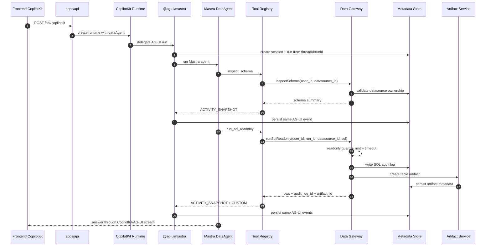

# Agent / Data Gateway / Knowledge 架构设计与开发方案

日期：2026-06-18
当前阶段：Day 1 - Day 5 后端骨架与 Agent 工具链

## 1. 当前结论

项目刚起步，不保留旧兼容层。当前研发 B 的目标架构是：

```text
CopilotKit / AG-UI
-> @ag-ui/mastra
-> Mastra DataAgent
-> typed tool registry
-> Data Gateway
-> Metadata / Artifacts / Knowledge
```

对外只保留一个后端运行时服务和一个 Agent 协议入口：

```text
GET  /healthz
POST /api/copilotkit
```

不再保留以下早期设计：

- 独立 BFF 服务框架层。
- 早期自定义 SSE 聊天入口。
- 前端直连 Data Gateway REST API。
- `AgentRuntimeAdapter` / mock adapter 抽象层。
- `apps/web` / `apps/tui` 在研发 B 工作区内的实现。

当前架构图：

[current-agent-architecture.svg](./current-agent-architecture.svg)

PlantUML 架构图：

[ag-ui-agent-runtime-architecture.puml](./ag-ui-agent-runtime-architecture.puml)

PlantUML 渲染图：

[ag-ui-agent-runtime-architecture.svg](./ag-ui-agent-runtime-architecture.svg)

## 2. 目标和边界

研发 B 负责 Agent / Data Gateway / Knowledge 的后端核心能力，不负责 UI。

核心目标：

- 让前端只对接 CopilotKit/AG-UI 协议。
- 让 Agent 使用 Mastra 原生 ReAct/tool calling 能力。
- 让所有数据访问都经过 Data Gateway。
- 让 SQL 安全、审计、artifact 生成不依赖模型自觉。
- 让 run/session/event/audit/artifact 都可被本地 metadata store 记录。

硬边界：

- 模型不能直接接触 datasource credential。
- 模型不能绕过 `run_sql_readonly` 拿数据。
- SQL 是否可执行由 Data Gateway 和 SQL guard 判断，不由模型判断。
- Agent 运行事件只记录 action/observation，不记录 hidden thought。
- Data Gateway 是内部工具边界，不是给前端直接调用的 REST API。

## 3. 当前模块

当前活跃模块共 9 个。

| 模块 | 职责 | 当前实现 |
| --- | --- | --- |
| `apps/api` | 单一后端运行时服务。负责 `/healthz`、`/api/copilotkit`、AG-UI `RunAgentInput` 解析、session/run 创建、CopilotKit runtime 装配、AG-UI event 持久化。 | Node `http` server；`@copilotkit/runtime` 的 `copilotRuntimeNodeHttpEndpoint`；自定义 `DataAgentAgUiAgent extends AbstractAgent`；`@ag-ui/mastra` 的 `MastraAgent`；`threadId -> session_id`，`runId -> run_id`。 |
| `packages/agent-runtime` | Agent 工厂和工具边界。创建 Mastra DataAgent、prompt、run context、typed tool registry。 | `@mastra/core/agent`；`@mastra/core/tools`；Zod input/output schema；工具实现位于 `src/tools/`；工具 `inspect_schema`、`run_sql_readonly`；AG-UI `ACTIVITY_SNAPSHOT` / `CUSTOM`；强制 inspect-before-SQL、selected datasource、最多 3 次 SQL。 |
| `packages/data-gateway` | 数据源注册、schema inspect、preview、只读 SQL、SQL guard、SQL audit、artifact 创建。 | `LocalDataGateway`；`node:sqlite`；CSV parser；`read-excel-file`；DuckDB demo / SQLite / CSV / XLSX adapters；`guardReadonlySql`。 |
| `packages/metadata` | 本地元数据事实源。 | `node:sqlite` `DatabaseSync`；migration；users/sessions/runs/run_events/data_sources/sql_audit_logs/artifacts repositories；`RunEventWriter` 写入 AG-UI `BaseEvent`。 |
| `packages/contracts` | 共享合约。 | API result、AG-UI `BaseEvent`-backed `RunEventEnvelope`、tool input types、artifact summary、env schema、`createEnvConfig`。 |
| `packages/providers` | 模型 provider 适配。 | `@ai-sdk/openai` 的 `provider.chat(model)` 用于 OpenAI-compatible `/chat/completions`；非 OpenAI-compatible provider 走 Mastra model router object；无 key 返回 mock marker。 |
| `packages/artifacts` | Artifact 创建服务。 | `LocalArtifactService` 写 metadata artifact record，当前主要用于 SQL table result preview。 |
| `packages/knowledge` | Knowledge/RAG 边界。 | 当前是接口和数据模型定义，为后续 collection/document/chunk/retrieval 实现留边界。 |
| `scripts` | 验证脚本。 | `smoke-metadata`、`smoke-data-gateway`、`smoke-sql`、`smoke-agent`、`smoke-copilotkit`。 |

## 4. 运行时流程



## 5. Agent 设计

### 5.1 Prompt 约束

`packages/agent-runtime` 中 `buildAgentInstructions` 明确约束：

- 只能通过 tools 访问数据。
- 不得编造 schema、rows、SQL execution result。
- 只能使用当前 selected datasource。
- 任何数据分析请求必须先调用 `inspect_schema`。
- 观察 schema 后再生成 `SELECT` 或 `WITH` SQL。
- SQL 必须通过 `run_sql_readonly` 执行。
- 不得暴露 credential、datasource config、环境变量。

### 5.2 Tool schema

当前 Mastra tools：

| Tool | Input | Output | Policy |
| --- | --- | --- | --- |
| `inspect_schema` | `{ datasource_id?: string; table_names?: string[] }` | `{ datasource_id; tables[] }` | datasource 必须等于 selected datasource。 |
| `run_sql_readonly` | `{ datasource_id?: string; sql: string; limit?: number; timeout_ms?: number }` | `{ columns; rows; row_count; audit_log_id; elapsed_ms; artifact_id? }` | 必须先 inspect schema；最多 3 次；SQL 再交给 Data Gateway guard。 |

Tool wrapper 只发 AG-UI 事件，不发自定义事件类型：

- `ACTIVITY_SNAPSHOT`：计划、schema step、SQL step、table output。
- `CUSTOM(name: "sql_audit")`：SQL audit 摘要。
- `CUSTOM(name: "artifact")`：artifact 摘要。

`DataAgentAgUiAgent` 负责把这些事件和 `@ag-ui/mastra` 自动生成的 `RUN_*`、`TEXT_MESSAGE_*`、`TOOL_CALL_*`、`REASONING_*` 合成同一条 AG-UI event stream，并按同一格式写入 `run_events`。

## 6. Data Gateway 设计

Data Gateway 当前公开 TypeScript 接口，而不是 HTTP API：

- `listDataSources`
- `supportTypes`
- `registerDataSource`
- `testConnect`
- `inspectSchema`
- `previewTable`
- `runSqlReadonly`

当前实现：

- `LocalDataGateway` 通过 metadata store 校验 datasource 归属。
- `guardReadonlySql` 阻断 DDL/DML、多语句、危险关键字等写操作。
- `runSqlReadonly` 写 `sql_audit_logs`。
- SQL 结果生成 table artifact。
- datasource config 不出现在 list summary 和 tool output 中。

当前支持的数据源：

- DuckDB demo。
- SQLite。
- CSV。
- XLSX。
- `postgresql` / `mysql` 类型保留在类型层，具体 adapter 还未实现。

## 7. Metadata / Artifacts / Knowledge

### Metadata

当前 `packages/metadata` 是本地事实源：

- users
- sessions
- runs
- run_events：AG-UI event stream 的 append-only 持久化副本。
- data_sources
- sql_audit_logs
- artifacts

实现使用 Node 22 的 `node:sqlite` `DatabaseSync`。本地开发会出现 SQLite experimental warning，当前可接受。

默认持久化粒度是一个后端 storage path 对应一个 SQLite metadata database：

```text
METADATA_DB_PATH=storage/metadata/workbench.sqlite
```

不是每次 run 创建一个 SQLite。`users`、`sessions`、`runs`、`run_events`、`data_sources`、`sql_audit_logs`、
`artifacts` 共享同一个 metadata database，并通过 `user_id`、`session_id`、`run_id` 分区。smoke tests 中出现的
临时 SQLite 只用于一次性验证，不代表运行时持久化策略。

### Artifacts

当前 artifact 主要服务 SQL table result：

- artifact metadata 写入 SQLite。
- preview JSON 存在 artifact record。
- 当前不暴露 artifact download REST endpoint。

### Knowledge

当前 `packages/knowledge` 只定义接口和模型：

- collection
- document
- chunk
- retrieval result

后续 Day 计划再实现 ingestion、embedding、retrieval。

## 8. Provider 策略

`packages/providers` 当前规则：

- `LLM_PROVIDER=openai-compatible` / `openai_compatible` / `bailian`：
  使用 `@ai-sdk/openai`，并调用 `provider.chat(model)`，也就是 `/chat/completions`。
- 其他 provider：
  使用 Mastra model router object：`{ id, url, apiKey }`。
- 无 `LLM_API_KEY`：
  返回 `kind: "mock"` marker。`/api/copilotkit` 会拒绝启动真实 runtime 并返回 `PROVIDER_CONFIG_MISSING`。

示例：

```text
LLM_PROVIDER=deepseek
LLM_MODEL=deepseek-v4-flash
LLM_BASE_URL=https://api.deepseek.com
LLM_API_KEY=...
```

```text
LLM_PROVIDER=openai-compatible
LLM_MODEL=qwen-plus
LLM_BASE_URL=https://dashscope.aliyuncs.com/compatible-mode/v1
LLM_API_KEY=...
```

## 9. 环境变量

当前 env schema：

```text
API_HOST=127.0.0.1
API_PORT=8787
LLM_PROVIDER=openai-compatible
LLM_MODEL=qwen-plus
LLM_BASE_URL=https://dashscope.aliyuncs.com/compatible-mode/v1
LLM_API_KEY=
EMBEDDING_PROVIDER=bailian
EMBEDDING_MODEL=text-embedding-v4
EMBEDDING_DIM=1024
EMBEDDING_OUTPUT_TYPE=dense
EMBEDDING_BASE_URL=https://dashscope.aliyuncs.com/compatible-mode/v1
EMBEDDING_API_KEY=
STORAGE_ROOT_DIR=storage
METADATA_DB_PATH=storage/metadata/workbench.sqlite
SQL_DEFAULT_LIMIT=100
SQL_MAX_LIMIT=1000
SQL_TIMEOUT_MS=10000
```

## 10. run_events 的角色

`run_events` 不再定义前端协议。它的角色是：

```text
AG-UI event stream 的 append-only 持久化副本
```

字段语义：

| 字段 | 来源 | 说明 |
| --- | --- | --- |
| `user_id` | 后端 user context | 用户隔离。 |
| `session_id` | AG-UI `threadId` | 会话/thread 维度回放。 |
| `run_id` | AG-UI `runId` | 单次执行维度回放。 |
| `seq` | 后端写入时分配 | run 内严格递增，保证回放排序。 |
| `event_type` | AG-UI `event.type` | 只能是 AG-UI `EventType`。 |
| `payload_json` | 原始 AG-UI event JSON | 回放和审计使用。 |

业务审计表如 `sql_audit_logs` 继续保留；但如果需要进入前端事件流，只能以 AG-UI `CUSTOM` 事件承载，不能新增自定义事件类型。

## 11. 当前验收

```bash
npm run typecheck
npm run smoke:metadata
npm run smoke:data-gateway
npm run smoke:sql
npm run smoke:agent
npm run smoke:api-context
npm run smoke:api
```

验收覆盖：

- metadata schema/repository/run event。
- datasource register/schema/preview。
- readonly SQL guard/audit/artifact。
- tool registry inspect-before-SQL policy。
- CopilotKit/AG-UI request context 中 datasource 和 user input 的提取。
- `/api/copilotkit` CORS 和 AG-UI runtime validation。

## 12. 后续开发顺序

继续遵守研发 B 顺序，不做 UI：

1. 强化 CopilotKit 真实请求集成测试，确认前端真实 payload 可以稳定触发 `dataAgent`。
2. 补齐 collection/user context 从 CopilotKit `context` / `forwardedProps` / `state` 中提取。
3. 完成 Knowledge ingestion/retrieval 的本地实现，并加入 `retrieve_knowledge` tool。
4. 增加更多 Data Gateway adapter，优先 PostgreSQL 或 MySQL 二选一。
5. 完善 artifact 生命周期和下载/预览策略，但只在需要时暴露服务端 endpoint。
6. 补充 agent policy 测试：跨 datasource、未 inspect 先 SQL、SQL 次数上限、危险 SQL。

## 13. npm audit 状态

当前 audit 状态：

```text
10 low / 10 moderate / 1 high
```

high 来自 CopilotKit 依赖链：

```text
@copilotkit/runtime
-> @ag-ui/langgraph
-> @langchain/core
-> langsmith
```

当前应用代码不直接调用 LangSmith，也不使用 LangGraph agent。不要直接执行 `npm audit fix --force`，后续优先等 CopilotKit / AG-UI 上游升级，或评估替换 runtime 版本。
