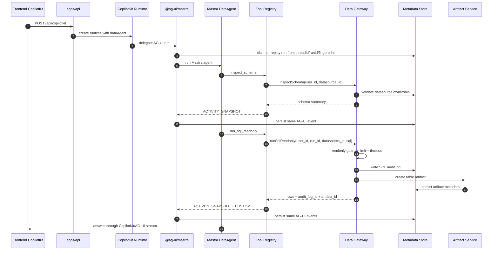

# Agent / Data Gateway / Knowledge 架构设计与开发方案

日期：2026-06-23
当前阶段：Context Governance Phase 1-3 已完成；配置管理 REST、effective run config、
Knowledge local-first、MCP middleware、Skill policy、PG/MySQL adapter 基础版、Conversation Memory 第一阶段已完成。

## 1. 当前结论

项目刚起步，不保留旧兼容层。当前研发 B 的目标架构是：

```text
CopilotKit / AG-UI
-> @ag-ui/mastra
-> Mastra DataAgent
-> typed tool registry
-> Data Gateway
-> Metadata / Artifacts / Knowledge
```

对外保留一个后端运行时服务，包含 Agent 协议入口和配置管理 REST 入口：

```text
GET  /healthz
POST /api/copilotkit
GET/POST/PATCH/DELETE /api/v1/*
```

不再保留以下早期设计：

- 独立 BFF 服务框架层。
- 早期自定义 SSE 聊天入口。
- 前端直连 Data Gateway REST API（Data Gateway 仍只在 agent tools 内部使用；配置管理 REST 不执行查询）。
- `AgentRuntimeAdapter` / mock adapter 抽象层。
- `apps/web` / `apps/tui` 在研发 B 工作区内的实现。

当前架构图：[PlantUML](./ag-ui-agent-runtime-architecture.puml) / [SVG](./ag-ui-agent-runtime-architecture.svg)

上下文架构：[权威交互 HTML](./agent-context-architecture.html) /
[五层流水线 SVG](./context-governance-pipeline.svg)

## 2. 目标和边界

研发 B 负责 Agent / Data Gateway / Knowledge 的后端核心能力，不负责 UI。

核心目标：

- 让前端只对接 CopilotKit/AG-UI 协议。
- 让 Agent 使用 Mastra 原生 ReAct/tool calling 能力。
- 让所有数据访问都经过 Data Gateway。
- 让 SQL 安全、审计、artifact 生成不依赖模型自觉。
- 让 run/session/event/audit/artifact 都可被本地 metadata store 记录。

硬边界：

- 模型不能直接接触 datasource credential。
- 模型不能绕过 `run_sql_readonly` 拿数据。
- SQL 是否可执行由 Data Gateway 和 SQL guard 判断，不由模型判断。
- Agent 运行事件只记录 action/observation，不记录 hidden thought。
- Data Gateway 是内部工具边界，不是给前端直接调用的 REST API。

## 3. 当前模块

当前活跃模块共 9 个。

| 模块 | 职责 | 当前实现 |
| --- | --- | --- |
| `apps/api` | 单一 runtime；CopilotKit/AG-UI run；配置管理 REST；run identity、claim、回放、task PLAN 投影和服务端 conversation history 组装。 | Node HTTP；CopilotKit runtime；`@ag-ui/mastra`；`@ag-ui/mcp-middleware`；`/api/v1` router。 |
| `packages/agent-runtime` | ReAct、逐 step context、数据/Workspace/task/协作/Knowledge 工具治理，Skill policy。 | Mastra；Memory task-state；ToolObservationAdapter registry；`retrieve_knowledge`；allowedTools 过滤。 |
| `packages/data-gateway` | 数据源注册、schema inspect、preview、只读 SQL、SQL guard、SQL audit、artifact 创建。 | `LocalDataGateway`；`node:sqlite`；CSV parser；`read-excel-file`；DuckDB demo / SQLite / CSV / XLSX / PostgreSQL / MySQL adapters；`guardReadonlySql`。 |
| `packages/metadata` | 本地元数据事实源。 | `node:sqlite`；用户级复合主键；identity migration；claim/find/replay；`RunEventWriter`；conversation message/summary repositories；配置资源、加密 secret、job repository。 |
| `packages/contracts` | 共享合约。 | API result、AG-UI `BaseEvent`-backed `RunEventEnvelope`、tool input types、artifact summary、env schema、`SECRET_MASTER_KEY`。 |
| `packages/providers` | 模型 provider 适配。 | OpenAI-compatible `/chat/completions`；Mastra model router object；profile-based provider factory；mock marker。 |
| `packages/artifacts` | Artifact 创建服务。 | `LocalArtifactService` 写 metadata artifact record，当前主要用于 SQL table result preview。 |
| `packages/knowledge` | Knowledge/RAG 边界。 | `LocalKnowledgeService`；document/chunk schema；FTS fallback；可选 embedding 向量索引；retrieve/reindex。 |
| `scripts` | 验证脚本。 | metadata、gateway、SQL、Agent、CopilotKit、context、collaboration、workspace、config API smoke。 |

## 4. 运行时流程



## 5. Agent 设计

### 5.1 Prompt 约束

`packages/agent-runtime` 中 `buildAgentInstructions` 明确约束：

- 只能通过 tools 访问数据。
- 不得编造 schema、rows、SQL execution result。
- 只能使用当前 selected datasource。
- 任何数据分析请求必须先调用 `inspect_schema`。
- 观察 schema 后再生成 `SELECT` 或 `WITH` SQL。
- SQL 必须通过 `run_sql_readonly` 执行。
- 不得暴露 credential、datasource config、环境变量。

### 5.2 Tool schema

当前 Mastra tools：

| Tool | Input | Output | Policy |
| --- | --- | --- | --- |
| `inspect_schema` | `{ datasource_id?: string; table_names?: string[] }` | `{ datasource_id; tables[] }` | datasource 必须等于 selected datasource。 |
| `run_sql_readonly` | `{ datasource_id?: string; sql: string; limit?: number; timeout_ms?: number }` | `{ columns; rows; row_count; audit_log_id; elapsed_ms; artifact_id? }` | 必须先 inspect schema；最多 3 次；SQL 再交给 Data Gateway guard。 |
| `retrieve_knowledge` | `{ query: string; knowledge_ids?: string[]; top_k?: number }` | `{ chunks[]; citations[] }` | 只能访问本轮 effective config 启用的 KB。 |

Tool wrapper 只发 AG-UI 事件，不发自定义事件类型：

- `ACTIVITY_SNAPSHOT`：计划、schema step、SQL step、table output。
- `CUSTOM(name: "sql_audit")`：SQL audit 摘要。
- `CUSTOM(name: "artifact")`：artifact 摘要。

`DataAgentAgUiAgent` 负责把这些事件和 `@ag-ui/mastra` 自动生成的 `RUN_*`、`TEXT_MESSAGE_*`、`TOOL_CALL_*`、`REASONING_*` 合成同一条 AG-UI event stream，并按同一格式写入 `run_events`。

### 5.3 Day 6 Agent Context Management

Day 6 先做 Agent 上下文治理，不接 Mastra memory。原因是工具返回值、SQL 结果、schema 摘要和 artifact 引用属于后端安全与审计边界，不能直接交给框架默认 memory 行为处理。

详细设计：

[agent-context-management-design.md](./agent-context-management-design.md)

Phase 1-3 已实现：

- 工具返回给模型的内容必须受预算控制。
- 大 SQL 结果不能完整进入模型上下文。
- 完整结果继续通过 artifact/audit 保留。
- schema 输出可以被压缩，但必须保留 datasource、表、列的基本可推理信息。
- AG-UI trace 继续可见，但事件 payload 不能无限增长。
- 不保存 hidden thought，不把 credential 放入上下文或 memory。
- conversation 只在 `processInputStep` 生产路径治理，没有第二套 AG-UI window adapter。
- 每个 ReAct step 生成 `ContextPlan`，按完整 turn 原子选择。
- provider-bound prompt 通过 `processLLMRequest` 最终硬校验。
- strategy registry 与 candidate selector 可替换，不固化完整压缩顺序。

上下文策略层：

```text
packages/agent-runtime/src/context/
  context-policy.ts
```

默认策略：

| 策略项 | 默认值 | 说明 |
| --- | --- | --- |
| `max_schema_tables` | 20 | 模型可见 schema 最多表数。 |
| `max_schema_columns_per_table` | 50 | 每张表最多列数。 |
| `max_sql_model_rows` | 20 | `run_sql_readonly` 返回给模型的最大行数。 |
| `max_sql_activity_rows` | 20 | AG-UI activity 中展示的最大行数。 |
| `max_cell_chars` | 500 | 单元格字符串最大长度。 |
| `max_sql_chars` | 4000 | activity 中 SQL 文本最大长度。 |

工具输出分层：

```text
Data Gateway result
-> Context policy
   -> model-visible tool result: small sample + audit_log_id + artifact_id
   -> AG-UI activity: small preview + truncation metadata
   -> artifact: full bounded query result preview
   -> sql_audit_logs: audit fact
```

Phase 4 已实现到 4.3：

- 新增 `conversation_messages`，按 `user_id + session_id` 保存可复用 user/assistant 自然语言消息。
- 新 run 进入 Mastra 前，由服务端组装最近历史和当前 user message，不再完全信任客户端回传历史。
- assistant 文本从 AG-UI `TEXT_MESSAGE_CONTENT` / `TEXT_MESSAGE_CHUNK` 提炼，完成运行后写入 conversation memory。
- `run_events` 仍负责完整 AG-UI 回放；conversation memory 只负责模型可复用历史。
- resume suspended run 暂时保持原链路，避免破坏 human-in-the-loop 恢复上下文。
- `ConversationMemoryService` 已成为生产入口，统一处理 current user 写入、history load、window policy 和 observer。
- 入口 conversation window 已支持 token-aware 估算裁剪和字符硬上限；当前 user message 始终保留。
- 新增 `conversation_summaries`，latest summary 可作为 tagged trusted context block 进入入口上下文。
- 自动 summary generator 已接入 `ConversationMemoryEventObserver.flushCompleted()`。
- 生产 runtime 已注入 Mastra `Agent.generate()` summarizer；生成失败时降级 deterministic fallback。
- replacement 策略已生效：latest summary 覆盖范围内的原始 message 不再进入入口 history 候选。

详细设计：

[2026-06-23-conversation-memory-design.md](./2026-06-23-conversation-memory-design.md)

Phase 5 尚未做：

- 不启用 observational memory。
- 不做 semantic recall。
- Knowledge/RAG 当前是 local-first tool，不等同于 conversation memory。
- Mastra memory 尚未接管 history；当前仅使用 Mastra Agent 作为 summary 生成器。

`ask_user` / `submit_plan` suspend-resume 已完成；native goal 已完成基础封装，仍缺独立 judge budget 和失败/耗尽
smoke。Conversation Memory 下一步是 LLM/Mastra summarizer 增强，然后再接 Mastra 原生 memory。

## 6. Data Gateway 设计

Data Gateway 当前公开 TypeScript 接口，而不是 HTTP API：

- `listDataSources`
- `supportTypes`
- `registerDataSource`
- `testConnect`
- `inspectSchema`
- `previewTable`
- `runSqlReadonly`

当前实现：

- `LocalDataGateway` 通过 metadata store 校验 datasource 归属。
- `guardReadonlySql` 阻断 DDL/DML、多语句、危险关键字等写操作。
- `runSqlReadonly` 写 `sql_audit_logs`。
- SQL 结果生成 table artifact。
- datasource config 不出现在 list summary 和 tool output 中。

当前支持的数据源：

- DuckDB demo。
- SQLite。
- CSV。
- XLSX。
- PostgreSQL。
- MySQL。

PG/MySQL adapter 已实现只读连接、schema introspection、preview 和 query timeout，但缺少本机真实服务端
smoke；正式交付前需要用用户提供的测试库再跑一轮端到端。

## 7. Metadata / Artifacts / Knowledge

### Metadata

当前 `packages/metadata` 是本地事实源：

- users
- sessions
- runs
- run_events：AG-UI event stream 的 append-only 持久化副本。
- data_sources
- sql_audit_logs
- artifacts

实现使用 Node 22 的 `node:sqlite` `DatabaseSync`。本地开发会出现 SQLite experimental warning，当前可接受。

默认持久化粒度是一个后端 storage path 对应一个 SQLite metadata database：

```text
METADATA_DB_PATH=storage/metadata/workbench.sqlite
```

不是每次 run 创建一个 SQLite。`users`、`sessions`、`runs`、`run_events`、`data_sources`、`sql_audit_logs`、
`artifacts` 共享同一个 metadata database，并通过 `user_id`、`session_id`、`run_id` 分区。smoke tests 中出现的
临时 SQLite 只用于一次性验证，不代表运行时持久化策略。

### Artifacts

当前 artifact 主要服务 SQL table result：

- artifact metadata 写入 SQLite。
- preview JSON 存在 artifact record。
- 已暴露 artifact detail / preview / content / download REST endpoint。
- 北向 `CUSTOM(name="artifact")` 已收敛为 id + 摘要引用，不携带 `preview_json`；模型只保留
  `artifact_id`，完整 preview / content / download 走 REST。

### Knowledge

当前 `packages/knowledge` 已实现 local-first RAG：

- collection/resource 配置由 `/api/v1/knowledge-bases` 管理。
- 文档上传后切 chunk 并写入 SQLite FTS5。
- 配置 embedding key 时写入向量索引并按 cosine 检索；无 key 时使用 FTS fallback。
- agent 通过 `retrieve_knowledge` tool 访问，不把整库内容注入 prompt。

## 8. Provider 策略

`packages/providers` 当前规则：

- `LLM_PROVIDER=openai-compatible` / `openai_compatible` / `bailian`：
  使用 `@ai-sdk/openai`，并调用 `provider.chat(model)`，也就是 `/chat/completions`。
- 其他 provider：
  使用 Mastra model router object：`{ id, url, apiKey }`。
- 无 `LLM_API_KEY`：
  返回 `kind: "mock"` marker。`/api/copilotkit` 会拒绝启动真实 runtime 并返回 `PROVIDER_CONFIG_MISSING`。

示例：

```text
LLM_PROVIDER=deepseek
LLM_MODEL=deepseek-v4-flash
LLM_BASE_URL=https://api.deepseek.com
LLM_API_KEY=...
```

```text
LLM_PROVIDER=openai-compatible
LLM_MODEL=qwen-plus
LLM_BASE_URL=https://dashscope.aliyuncs.com/compatible-mode/v1
LLM_API_KEY=...
```

## 9. 环境变量

当前 env schema：

```text
API_HOST=127.0.0.1
API_PORT=8787
LLM_PROVIDER=openai-compatible
LLM_MODEL=qwen-plus
LLM_BASE_URL=https://dashscope.aliyuncs.com/compatible-mode/v1
LLM_API_KEY=
EMBEDDING_PROVIDER=bailian
EMBEDDING_MODEL=text-embedding-v4
EMBEDDING_DIM=1024
EMBEDDING_OUTPUT_TYPE=dense
EMBEDDING_BASE_URL=https://dashscope.aliyuncs.com/compatible-mode/v1
EMBEDDING_API_KEY=
SECRET_MASTER_KEY=replace-with-a-long-random-local-key
STORAGE_ROOT_DIR=storage
METADATA_DB_PATH=storage/metadata/workbench.sqlite
MEMORY_EXTRACTION_TIMEOUT_MS=2000
SQL_DEFAULT_LIMIT=100
SQL_MAX_LIMIT=1000
SQL_TIMEOUT_MS=10000
```

## 10. run_events 的角色

`run_events` 不再定义前端协议。它的角色是：

```text
AG-UI event stream 的 append-only 持久化副本
```

字段语义：

| 字段 | 来源 | 说明 |
| --- | --- | --- |
| `user_id` | 后端 user context | 用户隔离。 |
| `session_id` | AG-UI `threadId` | 会话/thread 维度回放。 |
| `run_id` | AG-UI `runId` | 单次执行维度回放。 |
| `seq` | 后端写入时分配 | run 内严格递增，保证回放排序。 |
| `event_type` | AG-UI `event.type` | 只能是 AG-UI `EventType`。 |
| `payload_json` | 原始 AG-UI event JSON | 回放和审计使用。 |

业务审计表如 `sql_audit_logs` 继续保留；但如果需要进入前端事件流，只能以 AG-UI `CUSTOM` 事件承载，不能新增自定义事件类型。

## 11. 当前验收

```bash
npm run typecheck
npm run smoke:run-identity
npm run smoke:metadata
npm run smoke:data-gateway
npm run smoke:sql
npm run smoke:agent
npm run smoke:context-compilation
npm run smoke:api-context
npm run smoke:api
npm run smoke:config-api
npm run smoke:collaboration
npm run smoke:workspace
npm run smoke:tool-state
npm run test:web
```

验收覆盖：

- metadata schema/repository/run event。
- datasource register/schema/preview。
- readonly SQL guard/audit/artifact。
- tool registry inspect-before-SQL policy 和上下文预算策略。
- run fingerprint、claim、parent run、active conflict 和终态事件回放。
- 每 step context grouping/budget/reduction/provider guard。
- CopilotKit/AG-UI run_config、动态 task PLAN 投影和 datasource 提取。
- `/api/copilotkit` CORS 和 AG-UI runtime validation。
- `/api/v1` 配置资源、secret、revision、job、artifact、MCP、Skill、KB。
- ask_user/submit_plan suspend-resume、workspace tools、tool state isolation。

## 12. 后续开发顺序

继续遵守研发 B 顺序，不做 UI：

1. 前端把配置源从 localStorage 接到 `/api/v1`，但不改变 AG-UI run 协议。
2. 用真实 PostgreSQL / MySQL / 外部 model / MCP / embedding key 做集成验收。
3. Conversation Memory：历史所有权、message ID 去重、summary 和 working memory。
4. 清理 legacy run 级 `storage_path` artifact 兼容路径，继续统一 FileAssetRef / artifact 生命周期。
5. Knowledge citation/rerank、生产级向量库和后台 job 恢复。
6. 多用户认证与 workspace 共享。

## 13. npm audit 状态

当前 `npm audit` 已无 high / critical。已做的安全相关依赖处理：

- `next` 升级到 `15.5.19`，消除 Next 相关 high。
- `vitest` 升级到 `3.2.6`，消除 Vitest critical。
- root `overrides` 将 `@ag-ui/langgraph` 固定到 `0.0.42`，在 CopilotKit runtime 的
  semver 范围内避开旧 LangSmith high 链路。

剩余 low/moderate 主要来自 CopilotKit canary、AI SDK、Mastra client/core、Next 内嵌
PostCSS 与 uuid 传递依赖。不要直接执行 `npm audit fix --force`，因为 npm 会建议
破坏性版本变更。
