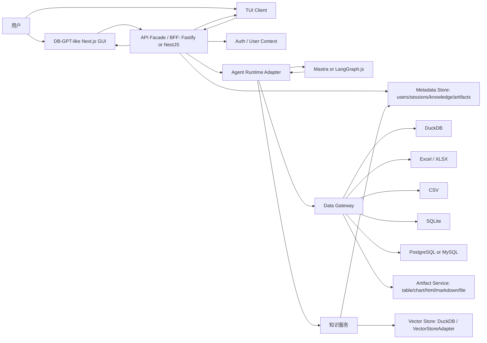

# DB-GPT 类数据智能体工作台 PRD v0.2

日期：2026-06-16
状态：最终 PRD / 研发交付版
项目：开放数据智能体工作台
来源简报：[db-gpt-like-data-agent-product-brief.md](../product/db-gpt-like-data-agent-product-brief.md)

## 1. 概要

### 问题陈述

业务分析师和内部数据用户经常需要借助结构化数据和分散的业务上下文来回答数据问题，例如指标定义、运营策略手册、PDF 报告和内部文档。纯数据库问答工具可以生成 SQL，但容易遗漏业务含义；纯文档问答工具可以引用定义，但无法对真实数据执行分析。

### 解决方案

采用 TypeScript-first Agent Runtime 架构、可替换的 Agent Runtime Adapter 和自研 Data Gateway，在 10 天内构建一个 DB-GPT 风格的 GUI 优先数据智能体工作台，并提供 TUI 作为外部用户的一等正式入口。MVP 应保留 DB-GPT 风格的工作台信息架构，完整支持一条旗舰工作流，并增加基础知识库能力，让用户可以按用户级上传文档/PDF，选择它们作为上下文，在 Web GUI 或 TUI 中发起分析，并在数据库或 Excel 分析时获得带引用的回答。默认模型部署选择国内模型服务：阿里云百炼 Qwen 聊天模型 + `text-embedding-v4` 嵌入模型。OpenCode 可以作为参考实现或可选 coding/tool 执行器，但不是核心运行时的强依赖。

### 成功标准

- 旗舰演示在准备好样本数据和样本知识文件后，从干净的本地运行可以在 ≤ 3 分钟内完成。
- 系统至少支持一条稳定的端到端工作流：上传知识文档/PDF → 选择知识 → 连接/使用演示数据库 → 提问业务问题 → 展示 ReAct 轨迹 → 执行只读 SQL → 生成带引用的表格/图表/报告。
- 对于 10 个预设演示问题，≥ 8 个在不需手动后端干预的情况下成功完成。
- 每份生成的报告在右侧面板中至少包含一个产出物：表格、图表、Markdown 报告、HTML 报告或引用的文档片段。
- 不支持的 DB-GPT 风格选项保持可见，但明确禁用或标记为"未启用"。
- 知识库上传、索引片段、检索结果和删除操作按用户级隔离，用户 A 不应看到或检索到用户 B 的上传文档。
- TUI 作为外部正式入口，可以复用同一后端运行链路完成一次知识库驱动的数据分析：登录/识别用户、选择 datasource/knowledge、输入问题、查看流式 ReAct 轨迹、查看 SQL、查看引用来源、获得 artifact 链接或导出路径。

## 2. 用户体验与功能

### 首批用户画像

主要用户：内部业务分析师、数据分析师或运营分析师。

该用户负责将业务问题转化为可信分析。他们可能不想手动编写每条 SQL，但可以审阅生成的 SQL、验证图表逻辑，判断结论是否符合业务定义。

补充用户：偏技术的数据分析师、数据工程师、分析工程师或外部开发者用户。他们更习惯在终端中运行、调试和复现 agent session，因此需要 TUI 作为正式产品入口来完成快速分析、观察执行轨迹和复用同一套后端能力。TUI 不是内部 debug 工具，必须走相同的用户身份、session、Data Gateway 和 artifact 合约。

次要演示受众：老板、业务干系人或内部平台负责人。他们不是日常的首批用户，而是买家/评估者，需要看到精致的工作台和清晰的"惊艳时刻"。

### 核心用户任务

- 连接或选择演示数据库。
- 以自己的用户身份上传包含指标定义或运营规则的 PDF 或业务文档。
- 在 Web GUI 或 TUI 中用自然语言提问业务问题。
- 查看智能体的计划、工具调用、SQL、文档检索片段和观察结果。
- 接收同时引用数据结果和源知识的表格、图表和报告。

### 旗舰演示工作流

推荐的旗舰演示：知识库驱动的数据库分析。

示例提示：

> 根据我上传的《电商指标口径说明.pdf》，分析过去 30 天 GMV 下滑的主要原因，按渠道、品类和新老用户拆解，给出 SQL、图表和一份汇报摘要。

预期流程：

1. 用户打开 Agentic Data 首页。
2. 用户上传或选择 `电商指标口径说明.pdf`。
3. 用户选择一个样本 DuckDB/SQLite 数据源，或已启用的 PostgreSQL/MySQL 连接器。
4. 用户提出业务问题。
5. 智能体创建可见的计划。
6. 智能体从知识库中检索相关的指标定义。
7. 智能体检查数据库 schema。
8. 智能体生成只读 SQL 并在执行轨迹中展示。
9. 智能体在行数限制和超时限制下执行 SQL。
10. 右侧面板展示结果表格和图表。
11. 最终报告引用上传的文档/PDF 并总结数据发现。

为什么这应该是旗舰：

- 证明产品不只是 ChatDB。
- 在一个连贯的故事中使用了知识库、数据源、ReAct 轨迹、SQL 执行和产出物。
- 对老板来说比后端能力矩阵更容易理解。
- 在不需要完整 DB-GPT 后端对等的情况下保留了 DB-GPT 风格的界面覆盖面。

### 辅助演示工作流

带可选知识上下文的 CSV/Excel 分析。

示例提示：

> 参考我上传的运营规则文档，分析这个 Excel 里的异常退款订单，输出分布图和处理建议。

这条路径作为备选演示很有用，因为它避免了外部数据库配置，仍然展示了文件上传、分析、图表和报告产出物。

### 产品界面层级

P0：10 天内必须可用。

- Agentic Data 首页：中央输入、模型选择器、文件上传、数据库选择器、知识选择器、已选上下文标签、发送按钮。
- 对话工作台：用户提问、任务计划、可见 ReAct 步骤、最终回答、左侧执行时间线、右侧产出物面板。
- 基础用户上下文：最小可用的登录/用户识别、当前用户态、用户级知识集合、用户级 session 和 artifact 归属。
- 数据源管理：支持的数据库卡片、禁用不支持的数据库卡片、连接抽屉、动态表单、测试连接、保存/删除/刷新。
- 知识库管理：创建/选择集合、上传 PDF/文档、解析/索引状态、文档列表、删除文档、在对话上下文中选择知识。
- TUI 客户端：登录/识别用户、选择/恢复 session、选择 datasource、选择自己的 knowledge collection、输入问题、查看流式 ReAct 轨迹、查看 SQL 与引用片段、打开或导出产出物链接。
- ReAct 流式运行：计划、步骤开始、工具输入/输出、观察、SQL、检索片段、最终回答、产出物。
- 产出物预览：表格、图表、Markdown 报告、HTML 报告、引用片段、可下载文件。

P1：视觉保留，部分实现。

- 技能选择器和管理。
- 连接器/MCP 选择器和管理。
- 提示词管理。
- 应用管理外壳。
- 本地导出分享对话。
- 定时任务入口。

P2：可见占位或禁用。

- AWEL Flow 编辑器。
- DBGPTS 社区。
- 模型评估页面。
- 移动端对话。
- 完整仪表盘构建器。
- 完整多数据库支持矩阵。
- 企业级知识库管理。
- TUI 中复刻完整 DB-GPT 管理控制台。

### 用户故事

故事 1：知识上传

作为分析师，我想上传 PDF 或业务文档，以便智能体可以使用我团队的指标定义和策略上下文来回答问题。

验收标准：

- 用户可以上传 PDF、TXT、Markdown 和 DOCX 文件。
- 不支持的文件类型在索引开始前显示明确的错误。
- UI 展示上传、解析、索引、成功和失败状态。
- 用户可以看到文档名称、文件类型、大小、状态和上传时间。
- 用户可以从集合中删除文档。
- 知识集合、文档、索引片段和删除操作都带有 `user_id`，默认只对上传用户可见。
- 用户 A 无法在列表、检索、引用或删除接口中访问用户 B 的知识文档。

故事 2：知识库驱动的回答

作为分析师，我想让智能体引用上传的文档，以便我可以信任业务定义的来源。

验收标准：

- 智能体在运行期间检索相关片段。
- 执行轨迹展示文档检索步骤。
- 最终回答包含源文档引用。
- 如果未找到相关片段，智能体说明未找到足够证据，而不是虚构引用。

故事 3：知识库 + 数据库分析

作为分析师，我想让智能体结合业务定义与数据库分析，以便最终报告既有数据依据又有语义准确性。

验收标准：

- 用户可以在同一运行中附加一个选定的知识集合和一个数据源。
- 智能体可以在生成 SQL 前检索指标定义。
- 生成的 SQL 在执行前或执行中展示在执行轨迹中。
- SQL 执行是只读的，有时间限制和行数限制。
- 最终报告包含数据结果和引用的业务上下文。

故事 4：Excel 分析

作为分析师，我想上传 CSV/Excel 数据并提问，以便无需配置数据库就能产出快速分析。

验收标准：

- 用户可以上传 CSV/XLSX。
- 系统预览前几行和推断的列。
- 智能体可以生成表格、图表和文字摘要。
- 如果附加了选定的知识文档，回答可以引用它。

故事 5：DB-GPT 风格选项保真度

作为评估者，我想让产品保留 DB-GPT 风格的选项结构，以便我能看到可信的工作台方向，即使有些功能尚未就绪。

验收标准：

- Chat Normal、Chat Data、Chat DB、Chat Excel、Chat Knowledge 和 Chat Dashboard 保持可见。
- 不支持的模式不会消失。
- 不支持的模式显示禁用、"即将推出"或"未启用"标签。
- 点击不支持的项目不会导致空白或损坏的页面。

故事 6：TUI 运行入口

作为偏技术的数据分析师、数据工程师或外部开发者用户，我想在终端中发起和观察数据智能体运行，以便快速调试、复现和分享分析过程。

验收标准：

- TUI 作为正式入口提供最小登录/用户识别能力，并与 Web GUI 使用同一用户上下文。
- 用户可以从 TUI 创建新 session 或恢复已有 session。
- 用户可以在 TUI 中选择 datasource、自己的 knowledge collection 和模型配置。
- 用户可以输入自然语言问题并看到流式 ReAct 轨迹。
- TUI 展示关键步骤：计划、知识检索、schema 检查、SQL 生成、只读 SQL 执行、产出物生成和最终回答。
- TUI 不直接访问数据库凭据，不直接执行 SQL，只通过 BFF/Data Gateway 调用受控工具。
- TUI 输出 artifact ID、文件路径或可打开链接；复杂图表和报告预览可以跳转到 Web GUI。

### 非目标

第一阶段不构建：

- 完整的 DB-GPT 后端兼容性。
- 企业级知识库管理。
- 扫描版 PDF 的 OCR。
- PDF 内图像、图表和复杂表格的高精度提取。
- 外部知识连接器，如 Notion、Confluence、Google Drive、SharePoint 或 S3。
- 多租户文档权限同步。
- 全文搜索调优控制台。
- 无限文档规模。
- 写入 SQL、DDL、DML 或生产数据修改。
- 完整仪表盘构建器。
- 生产级定时任务。
- 企业级 RBAC、审计、合规或计费。
- 作为 10 天演示阻塞项的原生桌面打包。
- TUI 与 Web GUI 的完整功能对等；MVP TUI 是正式入口，但只覆盖运行、观察、恢复和 artifact 访问，不复刻管理后台。

## 3. AI 系统需求

### 工具需求

MVP 运行时对智能体暴露的稳定工具：

- `retrieve_knowledge`：从当前用户选定的知识集合中检索带引用的片段。
- `list_data_sources`：列出 Data Gateway 暴露的可用数据源。
- `inspect_schema`：通过 Data Gateway 检查表、列和 schema 样本元数据。
- `preview_table`：在行数限制下预览表或上传的数据集。
- `run_sql_readonly`：通过 Data Gateway 执行只读 SELECT SQL，并应用超时、行数限制和审计日志。
- `profile_dataset`：总结数据集形状、字段、空值、分布和基础异常。
- `create_chart`：从表格结果创建图表产出物。
- `generate_report`：基于数据结果和引用知识生成 Markdown/HTML 报告产出物。
- `export_artifact`：导出生成的产出物用于下载。

实现说明：这些是稳定的产品工具，不为每一种数据源单独创建一个 agent tool。DuckDB、SQLite、CSV、XLSX，以及选定的 PostgreSQL/MySQL 连接器必须隐藏在 Data Gateway 后面。

### 知识库需求

MVP 支持格式：

- PDF
- TXT
- Markdown
- DOCX

旧版 `.doc`、扫描版 PDF、纯图像 PDF、PPT/PPTX、HTML 和外部文档链接不在 10 天 MVP 范围内。

MVP 索引行为：

- 存储文档元数据。
- 为知识集合、文档、分块、索引状态和引用元数据写入 `user_id`。
- 解析文本。
- 对文本分块。
- 使用默认国内嵌入提供商阿里云百炼 `text-embedding-v4` 创建稠密向量，默认维度 1024；模型名、维度和 base URL 通过环境变量可配置。
- 存储带有源文件名和页码/章节元数据的片段引用。
- 每次运行允许一个选定的知识集合。
- 默认每个知识集合归属于单个用户；MVP 不做跨用户共享知识库。

MVP 回答行为：

- 在回答依赖知识的问题前检索最相关的片段。
- 检索只在当前用户可访问的知识集合内执行。
- 在最终回答中包含来源引用。
- 当没有检索到的片段支持时，避免声称文档说了什么。
- 在 ReAct 时间线中展示检索观察。

### 评估策略

知识库评估集：

- 针对一个指标定义 PDF 的 10 个样本问题。
- 针对一个运营策略文档的 5 个样本问题。
- 5 个同时需要知识检索和 SQL/数据库分析的混合问题。

通过标准：

- ≥ 80% 的样本问题返回相关的引用来源。
- 0 个虚构的源文件名。
- 0 个跨用户知识检索泄漏：用户 A 的问题不能命中用户 B 的文档片段。
- 0 条破坏性 SQL 语句到达执行层。
- ≥ 8/10 旗舰演示问题无需手动干预即可完成。
- 对于解析失败、不支持的格式、空文档或检索缺失，用户可见的错误状态出现。

## 4. 技术规格

### 架构概览

产品应首先作为本地 Web 工作台构建。原生桌面打包在核心工作流稳定后可选。

目标架构采用 TypeScript-first，并要求运行时可替换：

- 首选方案：Mastra + Vercel AI SDK + 自研 Data Gateway。
- 长期可控性更强的备选方案：LangGraph.js + Vercel AI SDK + 自研 Data Gateway。
- OpenCode：作为参考实现、可选 coding/tool 执行器或可选集成路径，不作为必须依赖的核心运行时。

高层流程：

### 架构原则

- GUI contract first：先保留 DB-GPT-like GUI 和交互协议，再扩展后端能力。
- Multi-surface contract：Web GUI 和 TUI 都是一等正式客户端，必须复用同一 BFF、用户上下文、session、事件流、Data Gateway 和 artifact 结构。
- Agent runtime replaceable：运行时必须隐藏在 adapter 后面，Mastra、LangGraph.js、OpenCode 或未来运行时可以替换，不应重写产品界面。
- Data Gateway owns data access：datasource registry、连接管理、凭据隔离、schema introspection、read-only SQL、DuckDB/Excel/CSV 解析、query timeout、row limit、审计日志和 artifact handoff 归 Data Gateway 负责。
- User-scoped knowledge by default：知识上传、知识集合、分块索引、检索、删除和引用都默认按用户级隔离；MVP 不做全局知识库。
- Read-only by default：MVP 默认只读 SQL，拦截 DDL/DML 和破坏性语句。
- Artifact-first UX：表格、图表、HTML、Markdown、文件是一等输出，不是附属日志。
- Unsupported options visible but disabled：保留 DB-GPT-like 原型 fidelity，但避免不支持的产品承诺。

运行时边界：

- Agent runtime 不直接持有数据库凭据。
- Agent runtime 不直接自由执行 SQL。
- 所有数据访问都通过 Data Gateway 暴露的受控工具完成。
- SQL 审批、只读拦截、行数限制、超时、凭据遮蔽、运行历史和审计策略都位于 agent runtime 外部。
- Agent runtime 只能收到已经过 BFF 解析的 `user_id`、session context、可用工具列表和资源 ID，不自行决定跨用户资源访问。

### 最低 API 外观

身份和用户上下文：

- `GET /api/v1/me`
- `POST /api/v1/auth/login` 或本地开发模式等价登录入口
- `POST /api/v1/auth/logout`
- MVP 可以使用本地用户表、开发 token 或单机部署身份；但 BFF 必须在请求进入知识、session、artifact 和 TUI 运行链路前解析出 `user_id`。

Data Gateway / 数据源：

- `GET /api/v1/chat/db/list`
- `GET /api/v1/chat/db/support_type`
- `POST /api/v1/chat/db/test-connect`
- `POST /api/v1/chat/db/add`
- `POST /api/v1/chat/db/edit`
- `POST /api/v1/chat/db/delete`
- `POST /api/v1/chat/db/refresh`
- 内部工具合约：`list_data_sources`、`inspect_schema`、`preview_table`、`run_sql_readonly`、`profile_dataset`

知识库：

- `GET /api/v1/knowledge/collections`
- `POST /api/v1/knowledge/collections`
- `DELETE /api/v1/knowledge/collections/{id}`
- `GET /api/v1/knowledge/collections/{id}/documents`
- `POST /api/v1/knowledge/collections/{id}/upload`
- `POST /api/v1/knowledge/collections/{id}/reindex`
- `DELETE /api/v1/knowledge/documents/{id}`
- `POST /api/v1/knowledge/retrieve`
- 所有知识库 API 默认按当前 `user_id` 过滤；除非后续版本显式加入共享权限模型，否则不允许全局查询。

智能体运行：

- `POST /api/v1/chat/react-agent`
- SSE 流式事件：`plan.update`、`step.start`、`step.meta`、`step.output`、`step.chunk`、`step.done`、`final`、`done`。
- TUI 必须复用同一 agent run API、用户上下文和事件流，不允许直接绕过 BFF 调用 runtime 或 Data Gateway。

文件和产出物：

- `POST /api/v1/python/file/upload`
- `GET /api/v1/files/{id}/preview`
- `GET /api/v1/artifacts/{id}/download`
- 内部产出物工具：`create_chart`、`generate_report`、`export_artifact`

连接器、技能和应用：

- 保留足够的列表/创建/测试外壳 API 用于 UI 保真度。
- 不支持的执行路径可以返回结构化的"未启用"结果。

### 集成点

- Agent runtime：Mastra + Vercel AI SDK 是 MVP 首选路径；LangGraph.js + Vercel AI SDK 是长期可控性更强的备选路径。
- TUI client：Node/TypeScript TUI，建议优先评估 Ink 或同类成熟 TUI 库；MVP 要求作为外部正式入口复用 BFF/SSE/session/user API。
- OpenCode 集成：仅作为可选参考或工具执行集成；PRD 不依赖侵入式 OpenCode runtime 改造。
- LLM 提供商：默认使用国内 OpenAI 兼容聊天模型，首选阿里云百炼 Qwen；默认部署可使用 `qwen-plus`，`LLM_MODEL`、`LLM_BASE_URL` 和 `LLM_API_KEY` 必须可配置。
- 嵌入提供商：默认使用国内嵌入模型，首选阿里云百炼 `text-embedding-v4`；默认配置为 `EMBEDDING_MODEL=text-embedding-v4`、`EMBEDDING_DIM=1024`、`EMBEDDING_OUTPUT_TYPE=dense`。
- 向量存储：优先使用 DuckDB 作为本地向量存储，并通过 `VectorStoreAdapter` 隐藏实现；如 DuckDB VSS/向量扩展在 10 天内不稳定，允许降级为小规模 exact cosine 检索以保证演示。
- 本地嵌入备选：v1.1 可支持 BAAI `bge-m3` 或 Qwen3-Embedding 系列本地/私有化部署；MVP 不把本地模型下载、GPU/CPU 推理和模型服务化作为阻塞项。
- Data Gateway：负责 datasource registry、连接管理、凭据隔离、schema introspection、read-only SQL 执行、DuckDB/Excel/CSV 解析、query timeout、row limit、审计日志和 artifact handoff。
- P0 数据源：DuckDB、SQLite、CSV、XLSX，以及 PostgreSQL 或 MySQL 中选择一个 SQL server connector。
- 禁用但可见的选项：其他 DB-GPT-like 数据源卡片可以保留在 GUI 中，标记为 Coming soon / 未启用。
- 文件解析：知识库支持 PDF、TXT、Markdown、DOCX；数据分析支持 CSV/XLSX。

### 安全与隐私

- MVP 中文档默认存储在本地。
- 除了运行所需的配置 LLM/嵌入提供商，不将文件内容发送给第三方服务。
- 知识集合、文档、分块、嵌入引用、session、run 和 artifact 均必须记录 `user_id`。
- Web GUI 和 TUI 只能列出、检索、删除当前用户可访问的知识文档。
- Agent runtime 不存储数据源凭据。
- Agent runtime 不直接执行 SQL，只能请求受控的 Data Gateway 工具。
- SQL 执行默认为只读。
- 在执行前阻止 DDL/DML 和破坏性语句。
- 在日志和 UI 执行轨迹中隐藏凭证。
- 在 TUI 输出中同样隐藏凭证、连接串和敏感环境变量。
- 在运行历史中记录执行的 SQL 和选定的知识 ID。
- 为上传的文档提供明确的删除操作。
- 删除文档时必须同时删除或失效该用户对应的索引片段和向量引用；不得影响其他用户资源。

## 5. 风险与路线图

### 关键风险

- 知识库支持可能悄然演变为完整的 RAG 平台。保持其边界在上传、解析、索引、检索、引用。
- PDF 解析质量可能参差不齐。MVP 中不承诺 OCR 或完美的表格提取。
- 混合知识 + SQL 运行如果检索能力薄弱，可能产生幻觉。执行轨迹和引用必须暴露使用了什么证据。
- 过多可见的 DB-GPT 选项可能造成期望债务。不支持的状态必须明确标注。
- TUI 范围容易失控。MVP TUI 只做运行入口、session 恢复、流式轨迹、SQL/引用展示和 artifact 访问，不做完整管理后台。
- TUI 作为正式外部入口后会增加用户身份和安全成本。MVP 只做最小用户识别和资源隔离，不承诺企业 SSO/RBAC。
- 国内模型服务可能存在地域、限流、模型名变化和 API 兼容性差异。模型调用必须通过 Provider Adapter 与环境变量配置隔离。
- DuckDB 向量扩展可能在打包或部署上有不确定性。10 天演示允许小规模 exact cosine 降级，但必须保留 VectorStoreAdapter。
- 运行时框架锁定会拖慢后续产品演进。Agent Runtime Adapter 必须保持窄接口，避免 GUI 合约依赖 Mastra、LangGraph.js 或 OpenCode 特定状态结构。
- Data Gateway 可能膨胀成隐藏的平台项目。MVP 范围应收敛在 DuckDB、SQLite、CSV、XLSX，以及 PostgreSQL/MySQL 二选一。
- 原生桌面打包可能消耗时间但不改善核心演示。本地 Web 应保持为默认。

### 10 天计划

第 1 天：冻结产品范围和 GUI/TUI 合约。

- 确认旗舰演示和样本资产。
- 确定支持的文件格式和数据库列表。
- 确定默认模型：阿里云百炼 Qwen 聊天模型 + `text-embedding-v4`，并冻结环境变量命名。
- 冻结用户级知识隔离策略：知识集合、文档、chunk、session、artifact 都带 `user_id`。
- 定义 Web GUI 与 TUI 共用的 SSE 事件合约和 API 外观。

第 2 天：构建工作台外壳。

- 最小登录/用户上下文。
- Agentic Data 首页。
- 对话布局。
- 左侧 ReAct 时间线。
- 右侧产出物面板。
- 数据源、文件和知识的上下文标签。
- TUI 登录/用户识别、session 列表、新建/恢复 session、prompt 输入和流式输出骨架。

第 3 天：实现数据源和文件基础设施。

- DuckDB/SQLite 演示数据源。
- 通过 Data Gateway 实现 CSV/XLSX 上传和预览。
- 如果连接配置稳定，选择 PostgreSQL 或 MySQL 作为第一个服务器数据库连接器。
- 数据源卡片和连接抽屉。

第 4-5 天：实现可替换 agent runtime 和 Data Gateway 工具。

- 计划/步骤/观察/最终 流式传输。
- 先用 Mastra 实现 Agent Runtime Adapter，并保留 LangGraph.js 兼容边界。
- Web GUI 和 TUI 共同消费同一事件流。
- Schema 内省。
- 只读 SELECT SQL 生成和执行。
- Data Gateway 负责只读拦截、行数限制、超时和审计日志。
- 表格产出物。

第 5-6 天：实现知识库 MVP。

- 知识集合 UI。
- PDF/TXT/Markdown/DOCX 上传。
- 解析/索引状态。
- 阿里云百炼 `text-embedding-v4` 嵌入接入。
- DuckDB/VectorStoreAdapter 检索工具。
- 用户级知识隔离测试。
- 引用渲染。

第 7 天：实现混合工作流。

- 将知识 + 数据源附加到同一运行。
- 在生成 SQL 前检索指标定义。
- 生成有依据的表格/图表/报告。

第 8 天：应用模式和选项保真度。

- Chat Data 可用。
- Chat Knowledge 可用。
- Chat Excel 可用。
- Chat DB 部分。
- Chat Dashboard 仅报告。
- 不支持的模式禁用或 stub。

第 9 天：打磨演示和失败状态。

- 空白/加载/错误状态。
- 不支持选项的标签。
- 凭证遮蔽。
- 用户 A/B 隔离回归测试。
- TUI 错误态、取消运行、恢复 session 和 artifact 链接展示。
- 可重放的演示数据和样本文档。

第 10 天：稳定化和打包决策。

- 反复运行演示脚本。
- 修复 UI 重叠和损坏状态。
- 仅在 Web 工作流稳定时可选本地桌面封装。

### MVP 验收清单

- 用户可以上传至少一个 PDF 和一个文档文件到知识库。
- 用户上传的知识按用户级隔离；用户 A 无法列表、检索或删除用户 B 的知识文档。
- 用户可以提出 Chat Knowledge 问题并收到带引用的回答。
- 用户可以将知识库附加到 Chat Data 运行。
- 用户可以执行旗舰知识库驱动的数据库分析演示。
- 用户可以在 TUI 中完成同一旗舰分析的核心路径：选择上下文、输入问题、查看 ReAct 轨迹、查看 SQL/引用、获得 artifact 链接。
- TUI 作为正式入口复用同一用户身份、session、SSE 事件和 artifact API。
- 右侧面板在旗舰演示中展示至少两种产出物类型。
- ReAct 执行轨迹包含检索、SQL 生成、SQL 执行和产出物生成。
- 不支持的 DB-GPT 风格选项可见且安全禁用。
- 演示可以从干净状态重跑，有文档化的样本文件和样本数据库。

### 已确认产品决策

- 默认模型提供商：国内 OpenAI 兼容模型服务，首选阿里云百炼 Qwen；`qwen-plus` 作为默认部署模型，允许通过环境变量替换。
- 默认嵌入提供商：阿里云百炼 `text-embedding-v4`，默认 1024 维稠密向量，允许通过环境变量替换。
- 上传知识范围：用户级。知识集合、文档、分块、索引、检索、删除、session 引用和 artifact 引用都以 `user_id` 作为默认隔离边界。
- TUI 定位：外部用户正式入口。MVP 功能范围收敛在登录/用户识别、session、上下文选择、运行、流式轨迹、SQL/引用展示和 artifact 访问。

### 待确认的开放问题

这些问题不阻塞 v0.1 规划，但应在工程开始前确认：

1. MVP 是否需要旧版 `.doc` 支持，还是 `.docx` 对 Word 文档就够了？
2. 扫描版 PDF/OCR 是否明确排除在头 10 天范围外？
3. 本地 Web 对老板演示是否可接受，还是必须有桌面封装？
