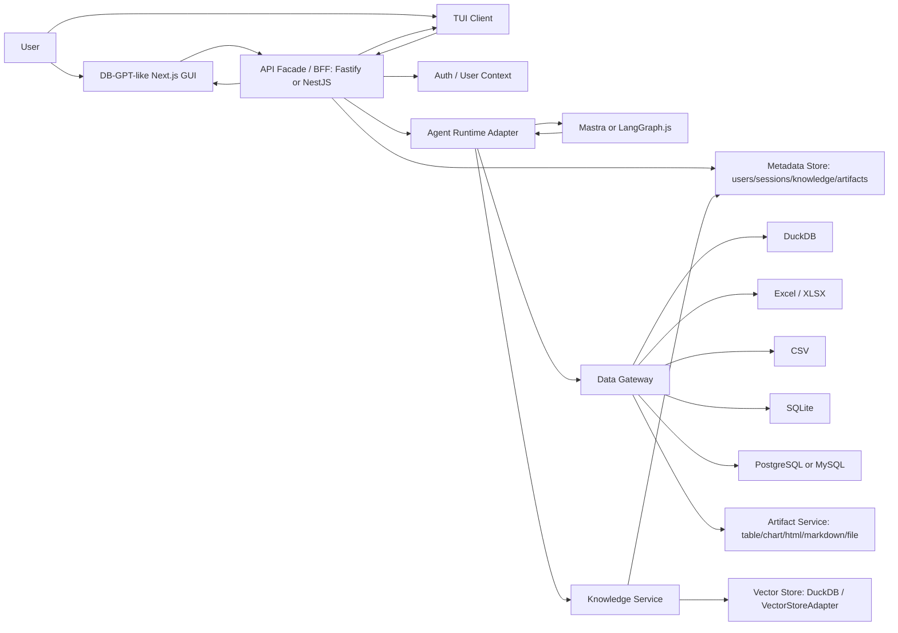

# DB-GPT-like Data Agent Workbench PRD v0.2

Date: 2026-06-16
Status: Final PRD / Engineering handoff
Project: Open Data Agent Workbench
Source brief: [db-gpt-like-data-agent-product-brief.md](../product/db-gpt-like-data-agent-product-brief.md)

## 1. Executive Summary

### Problem Statement

Business analysts and internal data users often need to answer data questions using both structured data and scattered business context, such as metric definitions, operation playbooks, PDF reports, and internal documents. A pure database Q&A tool can generate SQL, but it easily misses business meaning; a pure document Q&A tool can cite definitions, but it cannot execute analysis against real data.

### Proposed Solution

Build a DB-GPT-like GUI-first data-agent workbench in 10 days using a TypeScript-first agent runtime architecture, a replaceable Agent Runtime Adapter, and a self-developed Data Gateway, with TUI as a formal first-class external user entry point. The MVP should preserve the DB-GPT-like workbench information architecture, fully support one flagship workflow, and add basic Knowledge capability so users can upload documents/PDFs at user scope, select them as context, start analysis from either the Web GUI or TUI, and receive cited answers during database or Excel analysis. The default model deployment should use domestic model services: Alibaba Cloud Model Studio/Bailian Qwen for chat and `text-embedding-v4` for embeddings. OpenCode can be used as a reference implementation or optional coding/tool executor, but it is not a required core runtime dependency.

### Success Criteria

- The flagship demo can be completed from a clean local run in <= 3 minutes after sample data and sample knowledge files are prepared.
- The system supports at least one stable end-to-end workflow: upload knowledge document/PDF -> select knowledge -> connect/use demo database -> ask business question -> show ReAct trace -> execute read-only SQL -> generate table/chart/report with citations.
- For 10 preset demo questions, >= 8 complete successfully without manual backend intervention.
- Every generated report includes at least one artifact in the right panel: table, chart, markdown report, HTML report, or cited document snippets.
- Unsupported DB-GPT-like options remain visible but are clearly disabled or marked as not enabled in this deployment.
- Knowledge uploads, indexed chunks, retrieval results, and delete actions are isolated by user; user A must not see or retrieve user B's uploaded documents.
- The TUI can complete one knowledge-grounded data-analysis run through the same backend path as a formal entry point: authenticate/identify user, select datasource/knowledge, submit a question, view streamed ReAct trace, inspect SQL, inspect citations, and receive artifact links or export paths.

## 2. User Experience & Functionality

### First User Persona

Primary user: internal business analyst, data analyst, or operations analyst.

This user is responsible for turning business questions into credible analysis. They may not want to write every SQL query manually, but they can review generated SQL, validate chart logic, and judge whether a conclusion follows the business definition.

Complementary user: technical analyst, data engineer, analytics engineer, or external developer user. They prefer terminal workflows for running, debugging, and reproducing agent sessions, so they need the TUI as a formal product entry point that exposes the same backend run capability and execution trace. The TUI is not an internal debug tool; it must use the same user identity, session, Data Gateway, and artifact contracts.

Secondary demo audience: boss, business stakeholder, or internal platform leader. They are not the first daily user; they are the buyer/evaluator who needs to see a polished workbench and a clear "wow moment".

### Core User Jobs

- Connect or select a demo database.
- Upload a PDF or business document containing metric definitions or operating rules under their own user identity.
- Ask a natural-language business question from the Web GUI or TUI.
- Inspect the agent's plan, tool calls, SQL, document retrieval snippets, and observations.
- Receive a table, chart, and report that cite both data results and source knowledge.

### Flagship Demo Workflow

Recommended flagship demo: knowledge-grounded database analysis.

Example prompt:

> 根据我上传的《电商指标口径说明.pdf》，分析过去 30 天 GMV 下滑的主要原因，按渠道、品类和新老用户拆解，给出 SQL、图表和一份汇报摘要。

Expected flow:

1. User opens the Agentic Data home page.
2. User uploads or selects `电商指标口径说明.pdf`.
3. User selects a sample DuckDB/SQLite datasource, or the selected PostgreSQL/MySQL connector if it is enabled.
4. User asks the business question.
5. Agent creates a visible plan.
6. Agent retrieves relevant metric definitions from the knowledge collection.
7. Agent inspects database schema.
8. Agent generates read-only SQL and displays it in the trace.
9. Agent executes SQL with row limit and timeout.
10. Right panel shows result table and chart.
11. Final report cites the uploaded document/PDF and summarizes the data finding.

Why this should be the flagship:

- It proves the product is more than ChatDB.
- It uses Knowledge, Datasource, ReAct trace, SQL execution, and artifacts in one coherent story.
- It is easier for a boss to understand than a backend capability matrix.
- It preserves DB-GPT-like surface area without requiring full DB-GPT backend parity.

### Secondary Demo Workflow

CSV/Excel analysis with optional knowledge context.

Example prompt:

> 参考我上传的运营规则文档，分析这个 Excel 里的异常退款订单，输出分布图和处理建议。

This path is useful as a fallback demo because it avoids external database setup and still shows file upload, analysis, chart, and report artifacts.

### Product Surfaces

P0: must be usable in 10 days.

- Agentic Data home page: central input, model selector, file upload, database picker, knowledge selector, selected context tags, send button.
- Conversation workbench: user query, task plan, visible ReAct steps, final answer, left execution timeline, right artifact panel.
- Basic user context: minimum viable login/user identification, current user state, user-scoped knowledge collections, user-scoped sessions, and artifact ownership.
- Datasource management: supported DB cards, disabled unsupported DB cards, connection drawer, dynamic form, test connection, save/delete/refresh.
- Knowledge management: create/select collection, upload PDF/document, parse/index status, document list, delete document, select knowledge in chat context.
- TUI client: authenticate/identify user, create/resume session, select datasource, select the user's own knowledge collection, submit prompt, view streamed ReAct trace, inspect SQL and cited snippets, open or export artifact links.
- ReAct streaming run: plan, step start, tool input/output, observations, SQL, retrieval snippets, final answer, artifacts.
- Artifact preview: table, chart, markdown report, HTML report, cited snippets, downloadable files.

P1: preserve visually, implement partially.

- Skills selector and management.
- Connectors/MCP selector and management.
- Prompt management.
- App management shell.
- Share conversation as local export.
- Scheduled task entry.

P2: visible placeholder or disabled.

- AWEL Flow editor.
- DBGPTS community.
- Model evaluation pages.
- Mobile chat.
- Full dashboard builder.
- Full multi-database support matrix.
- Enterprise knowledge management.
- Full DB-GPT management-console parity inside the TUI.

### User Stories

Story 1: Knowledge upload

As an analyst, I want to upload a PDF or business document so that the agent can answer using my team's metric definitions and policy context.

Acceptance criteria:

- User can upload PDF, TXT, Markdown, and DOCX files.
- Unsupported file types show a clear error before indexing starts.
- The UI shows upload, parsing, indexing, success, and failed states.
- User can see document name, file type, size, status, and upload time.
- User can delete a document from the collection.
- Knowledge collections, documents, indexed chunks, and delete actions carry `user_id` and are visible only to the uploading user by default.
- User A cannot list, retrieve, cite, or delete user B's knowledge documents.

Story 2: Knowledge-grounded answer

As an analyst, I want the agent to cite uploaded documents so that I can trust where business definitions came from.

Acceptance criteria:

- Agent retrieves relevant chunks during the run.
- Trace shows a document retrieval step.
- Final answer includes source document references.
- If no relevant chunk is found, the agent says it did not find enough evidence instead of inventing a citation.

Story 3: Knowledge + database analysis

As an analyst, I want the agent to combine business definitions with database analysis so that the final report is both numerically grounded and semantically correct.

Acceptance criteria:

- User can attach one selected knowledge collection and one datasource to the same run.
- Agent can retrieve a metric definition before generating SQL.
- Generated SQL is displayed in the trace before or during execution.
- SQL execution is read-only, time-limited, and row-limited.
- Final report includes data result and cited business context.

Story 4: Excel analysis

As an analyst, I want to upload CSV/Excel data and ask questions so that I can produce quick analysis without configuring a database.

Acceptance criteria:

- User can upload CSV/XLSX.
- System previews the first rows and inferred columns.
- Agent can generate a table, chart, and written summary.
- If a selected knowledge document is attached, the answer can cite it.

Story 5: DB-GPT-like option fidelity

As an evaluator, I want the product to preserve the DB-GPT-like option structure so that I can see a credible workbench direction, even if some features are not ready.

Acceptance criteria:

- Chat Normal, Chat Data, Chat DB, Chat Excel, Chat Knowledge, and Chat Dashboard remain visible.
- Unsupported modes do not disappear.
- Unsupported modes show disabled, coming soon, or not enabled labels.
- Clicking unsupported items never leads to a blank or broken page.

Story 6: TUI run surface

As a technical analyst, data engineer, or external developer user, I want to start and observe data-agent runs in the terminal so that I can debug, reproduce, and share analysis sessions quickly.

Acceptance criteria:

- The TUI provides minimum viable login/user identification and uses the same user context as the Web GUI.
- User can create a new session or resume an existing session from the TUI.
- User can select datasource, their own knowledge collection, and model config from the TUI.
- User can submit a natural-language question and see a streamed ReAct trace.
- TUI shows key steps: plan, knowledge retrieval, schema inspection, SQL generation, read-only SQL execution, artifact generation, and final answer.
- TUI does not directly access datasource credentials or execute SQL; it only calls controlled tools through the BFF/Data Gateway.
- TUI outputs artifact IDs, file paths, or openable links; complex chart/report previews can open in the Web GUI.

### Non-Goals

The first phase does not build:

- Full DB-GPT backend compatibility.
- Enterprise-grade knowledge base management.
- OCR for scanned PDFs.
- High-fidelity extraction of images, charts, and complex tables inside PDFs.
- External knowledge connectors such as Notion, Confluence, Google Drive, SharePoint, or S3.
- Multi-tenant document permission sync.
- Full-text search tuning console.
- Unlimited document scale.
- Write SQL, DDL, DML, or production data modification.
- Full dashboard builder.
- Production scheduled jobs.
- Enterprise RBAC, audit, compliance, or billing.
- Native desktop packaging as a blocker for the 10-day demo.
- Full feature parity between the TUI and Web GUI; MVP TUI is a formal entry point but focuses on run, observation, resume, and artifact access instead of replicating the management console.

## 3. AI System Requirements

### Tool Requirements

Required agent-facing tools for MVP runtime:

- `retrieve_knowledge`: retrieve cited snippets from the current user's selected knowledge collections.
- `list_data_sources`: list available data sources exposed by the Data Gateway.
- `inspect_schema`: inspect tables, columns, and sample schema metadata through the Data Gateway.
- `preview_table`: preview a table or uploaded dataset with row limits.
- `run_sql_readonly`: execute SELECT-only SQL through the Data Gateway with timeout, row limit, and audit logging.
- `profile_dataset`: summarize dataset shape, columns, nulls, distributions, and basic anomalies.
- `create_chart`: create chart artifacts from tabular results.
- `generate_report`: generate Markdown/HTML report artifacts from data results and cited knowledge.
- `export_artifact`: export generated artifacts for download.

Implementation note: these are stable product tools, not one tool per datasource. DuckDB, SQLite, CSV, XLSX, and the selected PostgreSQL/MySQL connector must be hidden behind the Data Gateway.

### Knowledge Requirements

MVP supported formats:

- PDF
- TXT
- Markdown
- DOCX

Legacy `.doc`, scanned PDFs, image-only PDFs, PPT/PPTX, HTML, and external document links are out of scope for the 10-day MVP.

MVP indexing behavior:

- Store document metadata.
- Write `user_id` to knowledge collections, documents, chunks, indexing status, and citation metadata.
- Parse text.
- Chunk text.
- Create dense embeddings using the default domestic embedding provider, Alibaba Cloud Model Studio/Bailian `text-embedding-v4`, with default dimension 1024; model name, dimension, and base URL must be configurable through environment variables.
- Store chunk references with source filename and page/section metadata when available.
- Allow one selected knowledge collection per run.
- Each knowledge collection belongs to one user by default; cross-user shared knowledge is out of scope for the MVP.

MVP answer behavior:

- Retrieve top relevant chunks before answering knowledge-dependent questions.
- Retrieve only within knowledge collections accessible to the current user.
- Include source references in final answers.
- Avoid claiming a document says something when no retrieved chunk supports it.
- Show retrieval observations in the ReAct timeline.

### Evaluation Strategy

Knowledge evaluation set:

- 10 sample questions against one metrics-definition PDF.
- 5 sample questions against one operations-policy document.
- 5 mixed questions requiring both knowledge retrieval and SQL/database analysis.

Pass criteria:

- >= 80% of sample questions return a relevant cited source.
- 0 fabricated source filenames.
- 0 cross-user knowledge retrieval leaks: user A's question must not retrieve chunks from user B's documents.
- 0 destructive SQL statements reach execution.
- >= 8/10 flagship demo questions complete without manual intervention.
- User-visible error state appears for parsing failure, unsupported format, empty document, or retrieval miss.

## 4. Technical Specifications

### Architecture Overview

The product should be built as a local web workbench first. Native desktop packaging is optional after the core workflow is stable.

The target architecture is TypeScript-first and runtime-replaceable:

- Preferred path: Mastra + Vercel AI SDK + self-developed Data Gateway.
- More controllable long-term fallback: LangGraph.js + Vercel AI SDK + self-developed Data Gateway.
- OpenCode: reference implementation, optional coding/tool executor, or optional integration path. It must not be treated as a required core runtime dependency.

High-level flow:

### Architecture Principles

- GUI contract first: preserve the DB-GPT-like GUI and interaction protocol before broadening backend capability.
- Multi-surface contract: Web GUI and TUI are both formal first-class clients and must reuse the same BFF, user context, sessions, event stream, Data Gateway, and artifact structure.
- Agent runtime replaceable: the runtime must be hidden behind an adapter so Mastra, LangGraph.js, OpenCode, or future runtimes can be swapped without rewriting the product surface.
- Data Gateway owns data access: datasource registry, connection management, credential isolation, schema introspection, read-only SQL, DuckDB/Excel/CSV parsing, query timeout, row limit, audit logs, and artifact handoff belong to the Data Gateway.
- User-scoped knowledge by default: knowledge uploads, collections, chunks, retrieval, deletion, and citations are isolated by user by default; the MVP does not provide global knowledge bases.
- Read-only by default: MVP SQL execution blocks DDL/DML and destructive statements by default.
- Artifact-first UX: tables, charts, HTML, Markdown, and files are first-class outputs, not secondary logs.
- Unsupported options visible but disabled: preserve DB-GPT-like prototype fidelity while avoiding unsupported product claims.

Runtime boundaries:

- The agent runtime does not directly hold database credentials.
- The agent runtime does not freely execute SQL.
- All data access happens through controlled Data Gateway tools.
- SQL approval, read-only enforcement, row limit, timeout, credential masking, run history, and audit policy live outside the agent runtime.
- The agent runtime only receives the `user_id`, session context, available tool list, and resource IDs already resolved by the BFF; it must not make independent cross-user access decisions.

### Minimum API Facade

Identity and user context:

- `GET /api/v1/me`
- `POST /api/v1/auth/login` or an equivalent local-development login entry
- `POST /api/v1/auth/logout`
- The MVP can use a local user table, development token, or single-machine deployment identity, but the BFF must resolve `user_id` before requests enter knowledge, session, artifact, and TUI run paths.

Data Gateway / datasource:

- `GET /api/v1/chat/db/list`
- `GET /api/v1/chat/db/support_type`
- `POST /api/v1/chat/db/test-connect`
- `POST /api/v1/chat/db/add`
- `POST /api/v1/chat/db/edit`
- `POST /api/v1/chat/db/delete`
- `POST /api/v1/chat/db/refresh`
- internal tool contract: `list_data_sources`, `inspect_schema`, `preview_table`, `run_sql_readonly`, `profile_dataset`

Knowledge:

- `GET /api/v1/knowledge/collections`
- `POST /api/v1/knowledge/collections`
- `DELETE /api/v1/knowledge/collections/{id}`
- `GET /api/v1/knowledge/collections/{id}/documents`
- `POST /api/v1/knowledge/collections/{id}/upload`
- `POST /api/v1/knowledge/collections/{id}/reindex`
- `DELETE /api/v1/knowledge/documents/{id}`
- `POST /api/v1/knowledge/retrieve`
- All Knowledge APIs filter by the current `user_id` by default; global search is forbidden unless a later release explicitly adds a sharing permission model.

Agent run:

- `POST /api/v1/chat/react-agent`
- SSE stream events: `plan.update`, `step.start`, `step.meta`, `step.output`, `step.chunk`, `step.done`, `final`, `done`.
- TUI must reuse the same agent run API, user context, and event stream; it must not bypass the BFF to call the runtime or Data Gateway directly.

Files and artifacts:

- `POST /api/v1/python/file/upload`
- `GET /api/v1/files/{id}/preview`
- `GET /api/v1/artifacts/{id}/download`
- internal artifact tools: `create_chart`, `generate_report`, `export_artifact`

Connectors, skills, and apps:

- Keep list/create/test shell APIs enough for UI fidelity.
- Unsupported execution paths can return a structured not-enabled result.

### Integration Points

- Agent runtime: Mastra + Vercel AI SDK is the preferred MVP path; LangGraph.js + Vercel AI SDK is the long-term controllable fallback.
- TUI client: Node/TypeScript TUI, with Ink or a comparable mature TUI library as the first option; MVP requirement is to act as a formal external entry point and reuse BFF/SSE/session/user APIs.
- OpenCode integration: optional reference or tool-execution integration only; the PRD must not depend on invasive OpenCode runtime changes.
- LLM provider: domestic OpenAI-compatible chat model by default, with Alibaba Cloud Model Studio/Bailian Qwen as the first choice; default deployment can use `qwen-plus`, and `LLM_MODEL`, `LLM_BASE_URL`, and `LLM_API_KEY` must be configurable.
- Embedding provider: domestic embedding model by default, with Alibaba Cloud Model Studio/Bailian `text-embedding-v4` as the first choice; default config is `EMBEDDING_MODEL=text-embedding-v4`, `EMBEDDING_DIM=1024`, and `EMBEDDING_OUTPUT_TYPE=dense`.
- Vector store: prefer DuckDB as the local vector store behind `VectorStoreAdapter`; if DuckDB VSS/vector extension integration is unstable within 10 days, fallback to small-scale exact cosine retrieval for the demo.
- Local embedding fallback: v1.1 can support BAAI `bge-m3` or Qwen3-Embedding local/private deployment; local model download, CPU/GPU inference, and model serving are not MVP blockers.
- Data Gateway: owns datasource registry, connection management, credential isolation, schema introspection, read-only SQL execution, DuckDB/Excel/CSV parsing, query timeout, row limit, audit logs, and artifact handoff.
- P0 data sources: DuckDB, SQLite, CSV, XLSX, and one SQL server connector from PostgreSQL or MySQL.
- Disabled but visible options: other DB-GPT-like datasource cards can remain in the GUI as Coming soon / not enabled.
- File parsing: PDF, TXT, Markdown, DOCX for knowledge; CSV/XLSX for data analysis.

### Security & Privacy

- Documents are stored locally by default in the MVP.
- Do not send file contents to third-party services except the configured LLM/embedding provider required for the run.
- Knowledge collections, documents, chunks, embedding references, sessions, runs, and artifacts must record `user_id`.
- Web GUI and TUI can only list, retrieve, and delete knowledge documents accessible to the current user.
- The agent runtime must not store datasource credentials.
- The agent runtime must not execute SQL directly; it can only request controlled Data Gateway tools.
- SQL execution is read-only by default.
- Block DDL/DML and destructive statements before execution.
- Hide credentials in logs and UI traces.
- Hide credentials, connection strings, and sensitive environment variables in TUI output as well.
- Record executed SQL and selected knowledge IDs in run history.
- Provide clear delete action for uploaded documents.
- Deleting a document must delete or invalidate that user's corresponding indexed chunks and vector references without affecting other users' resources.

## 5. Risks & Roadmap

### Key Risks

- Knowledge support can quietly become a full RAG platform. Keep it bounded to upload, parse, index, retrieve, cite.
- PDF parsing quality may vary. Do not promise OCR or perfect table extraction in MVP.
- Mixed knowledge + SQL runs may hallucinate if retrieval is weak. The trace and citations must expose what evidence was used.
- Too many visible DB-GPT options can create expectation debt. Unsupported states must be explicit.
- TUI scope can easily sprawl. MVP TUI only covers run entry, session resume, streamed trace, SQL/citation display, and artifact access; it does not implement the full management console.
- Treating the TUI as a formal external entry point adds identity and security cost. MVP only promises minimum viable user identification and resource isolation, not enterprise SSO/RBAC.
- Domestic model services may introduce region, rate limit, model-name, and API-compatibility differences. Model calls must be isolated behind provider adapters and environment configuration.
- DuckDB vector extensions may be uncertain in packaging or deployment. The 10-day demo can fall back to small-scale exact cosine retrieval, but must keep `VectorStoreAdapter`.
- Runtime lock-in can slow future product evolution. Keep the Agent Runtime Adapter narrow and avoid depending on Mastra, LangGraph.js, or OpenCode-specific state structures in the GUI contract.
- Data Gateway can become a hidden platform project. Keep MVP scope to DuckDB, SQLite, CSV, XLSX, and one of PostgreSQL/MySQL.
- Native desktop packaging can consume time without improving the core demo. Local web should remain the default.

### 10-Day Plan

Day 1: freeze product scope and GUI/TUI contract.

- Confirm flagship demo and sample assets.
- Decide supported file formats and database list.
- Confirm default models: Alibaba Cloud Model Studio/Bailian Qwen chat model + `text-embedding-v4`, and freeze environment variable names.
- Freeze user-scoped knowledge isolation: knowledge collections, documents, chunks, sessions, and artifacts all carry `user_id`.
- Define shared SSE event contract and API facade for Web GUI and TUI.

Day 2: build workbench shell.

- Minimum login/user context.
- Agentic Data home.
- Conversation layout.
- Left ReAct timeline.
- Right artifact panel.
- Context tags for datasource, files, and knowledge.
- TUI login/user identification, session list, create/resume session, prompt input, and streaming-output skeleton.

Day 3: implement datasource and file foundations.

- DuckDB/SQLite demo datasource.
- CSV/XLSX upload and preview through the Data Gateway.
- Choose PostgreSQL or MySQL as the first server database connector if setup is stable.
- Datasource cards and connection drawer.

Day 4-5: implement replaceable agent runtime and Data Gateway tools.

- Plan/step/observation/final streaming.
- Agent Runtime Adapter with Mastra first, LangGraph.js-compatible boundaries.
- Web GUI and TUI consume the same event stream.
- Schema introspection.
- SELECT-only SQL generation and execution.
- Data Gateway read-only enforcement, row limit, timeout, and audit logs.
- Table artifact.

Day 5-6: implement Knowledge MVP.

- Knowledge collection UI.
- PDF/TXT/Markdown/DOCX upload.
- Parse/index status.
- Alibaba Cloud Model Studio/Bailian `text-embedding-v4` embedding integration.
- DuckDB/VectorStoreAdapter retrieval tool.
- User-scoped knowledge isolation tests.
- Citation rendering.

Day 7: implement mixed workflow.

- Attach knowledge + datasource to one run.
- Retrieve metric definition before SQL generation.
- Generate grounded table/chart/report.

Day 8: app modes and option fidelity.

- Chat Data usable.
- Chat Knowledge usable.
- Chat Excel usable.
- Chat DB partial.
- Chat Dashboard report-only.
- Unsupported modes disabled or stubbed.

Day 9: polish demo and failure states.

- Empty/loading/error states.
- Unsupported option labels.
- Credential masking.
- User A/B isolation regression test.
- TUI error states, cancel run, resume session, and artifact-link display.
- Replayable demo data and sample documents.

Day 10: stabilization and packaging decision.

- Run demo script repeatedly.
- Fix UI overlap and broken states.
- Optional local desktop wrapper only if the web workflow is stable.

### MVP Acceptance Checklist

- User can upload at least one PDF and one document file into Knowledge.
- Uploaded knowledge is isolated by user; user A cannot list, retrieve, or delete user B's knowledge documents.
- User can ask a Chat Knowledge question and receive cited answer.
- User can attach Knowledge to a Chat Data run.
- User can execute the flagship knowledge-grounded database analysis demo.
- User can complete the same flagship analysis core path from the TUI: select context, submit question, view ReAct trace, inspect SQL/citations, and receive artifact links.
- TUI acts as a formal entry point and reuses the same user identity, session, SSE event, and artifact APIs.
- Right panel shows at least two artifact types in the flagship demo.
- ReAct trace includes retrieval, SQL generation, SQL execution, and artifact generation.
- Unsupported DB-GPT-like options are visible and safely disabled.
- Demo can be rerun from clean state with documented sample files and sample database.

### Confirmed Product Decisions

- Default model provider: domestic OpenAI-compatible model service, with Alibaba Cloud Model Studio/Bailian Qwen as the first choice; `qwen-plus` is the default deployment model and can be replaced through environment variables.
- Default embedding provider: Alibaba Cloud Model Studio/Bailian `text-embedding-v4`, default 1024-dimensional dense vectors, replaceable through environment variables.
- Knowledge upload scope: user-scoped. Knowledge collections, documents, chunks, indexes, retrieval, deletion, session references, and artifact references use `user_id` as the default isolation boundary.
- TUI positioning: formal external user entry point. MVP scope is constrained to login/user identification, session, context selection, run, streamed trace, SQL/citation display, and artifact access.

### Open Questions For Confirmation

These questions do not block the v0.1 plan, but should be confirmed before engineering starts:

1. Does the MVP need legacy `.doc` support, or is `.docx` enough for Word documents?
2. Are scanned PDFs/OCR explicitly out of scope for the first 10 days?
3. Is local web acceptable for the boss demo, or must there be a desktop wrapper?
